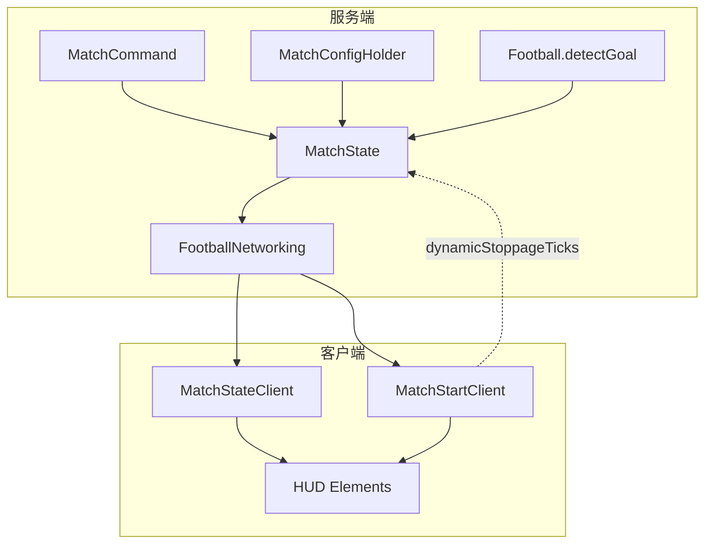

# 足球比赛机制

本文档说明 NMBCT Football 模组中**正式比赛流程**的设计：队伍与角色、阶段计时、开球锁定、进球/出界判定、配置与命令，以及服务端与客户端的协作方式。

球体物理与踢球输入见 [FOOTBALL_PHYSICS.md](./FOOTBALL_PHYSICS.md)；模组概览见 [README.md](./README.md)。

## 设计目标

- **服务端权威**：比分、阶段、计时、开球方、球复位均由服务端 `MatchState` 维护；客户端负责 HUD 与开球倒计时体验。
- **可配置的赛场几何**：球门矩形、底线朝向、边线、开球点、角球/门球点、双方出生点均来自 `MatchConfig`。
- **自动判例**：球每 tick 位移后检测是否穿越门线或边线，区分进球、无效进球、角球、球门球、界外球。
- **开球纪律**：非发球方在开球锁定期间无法操作足球；拖延开球会累积动态补时并触发裁判哨声。
- **GM 可控**：`/match` 命令管理开赛、阶段、比分、队伍与守门员；配置文件与 GUI 编辑赛场参数。
- **可选辅助功能**：比赛设置中可开启全场足球位置指示，帮助参赛玩家在球出屏时定位足球（纯客户端 HUD，不改变物理或判例）。

## 架构概览

### 源码结构

| 路径 | 职责 |
|------|------|
| `match/MatchState.kt` | 全局比赛状态：比分、阶段、计时、队伍、开球锁定 |
| `match/MatchPhase.kt` | 比赛阶段枚举与线性 `next` 链 |
| `match/MatchConfig.kt` | 赛场与规则配置（Codec）；含 `rules`、`accessibility` 嵌套段 |
| `match/MatchRulesSettings.kt` | 时长、补时、加时、点球、复位延迟等规则 |
| `match/MatchAccessibilitySettings.kt` | 辅助功能开关（如足球位置指示） |
| `match/MatchFieldBounds.kt` | 由球门/边线推导球场水平矩形及指示范围 |
| `match/MatchConfigHolder.kt` | 加载/保存 `config/nmbct-football-match.json` |
| `match/MatchCommand.kt` | `/match` 命令 |
| `match/PlayerRoleState.kt` | 官方/自愿守门员 |
| `match/PostGoalBallResetScheduler.kt` | 进球/出界/无效进球后延迟复位足球 |
| `match/PendingAfterReset.kt` | 足球复位完成后的开球阶段（含无效进球重开） |
| `match/MatchKickoffTiming.kt` | 开球锁定时长常量 |
| `Football.kt` | `detectGoal`：门线/边线穿越检测 |
| `network/FootballNetworking.kt` | 计时 tick、包广播、半场开球 |
| `input/FootballPlayerActions.kt` | 开球锁定校验与触球通知 |
| `client/match/MatchStateClient.kt` | 阶段切换、半场/结算请求 |
| `client/match/MatchStartClient.kt` | 开球倒计时、客户端补时累积 |
| `client/render/*HudElement.kt` | 比赛 HUD、进球/无效进球/出界 Banner 等 |
| `client/DribbleBallIndicatorClient.kt` | 带球 / 全场指示的足球跟踪（客户端） |
| `client/render/DribbleBallOffscreenHudElement.kt` | 球不在屏幕内时的边缘箭头 + 足球图标 |
| `client/config/yacl/MatchSetupConfigScreen.kt` | `/match setup` 规则与辅助功能 GUI |
| `client/config/yacl/MatchFieldConfigScreen.kt` | `/match config` 赛场几何 YACL 界面与分组 |
| `client/config/yacl/MatchFieldYaclExtensions.kt` | 赛场 GUI 的 `addPosition` / `addPositionAndFacing` 等扩展 |
| `client/config/yacl/MatchFieldPlayerSamples.kt` | 从本地玩家读取站位/朝向/边线坐标 |
| `client/config/yacl/controller/*` | 内联数字框、`Vec3`、出生点（含朝向）自定义 Controller |
| `client/mixin/ListEntryWidgetMixin.java` | 列表项内联编辑时转发键盘事件（见赛场 GUI） |
| `client/config/MatchFieldConfigNetworking.kt` | 打开赛场 GUI 时接收 `MatchFieldConfigSyncS2CPayload` |
| `network/InvalidGoalS2CPayload.kt` | S2C：无效进球 HUD |
| `stamina/StaminaState.kt` | 服务端权威体力：消耗、回复、`tryConsume`、比赛事件 |
| `stamina/BoostSprintState.kt` | 加速疾跑状态、移速修饰与体力同步联动 |
| `client/StaminaClient.kt` | 客户端体力同步、HUD 紫条渐变、移速修正 |
| `config/server/StaminaMechanismSettings.kt` | 体力机制配置（`stamina_mechanism`） |
| `config/server/StaminaActionCostsSettings.kt` | 动作体力（鱼跃/滑铲/加速疾跑）嵌套在 `action_costs` |

## 体力机制

比赛中的**体力**与**移速 debuff** 由服务端 [`StaminaState`](src/main/kotlin/net/astrorbits/football/stamina/StaminaState.kt) 每 tick 计算，经 `StaminaSyncS2CPayload` 同步到客户端；客户端 [`StaminaClient`](src/client/kotlin/net/astrorbits/football/client/StaminaClient.kt) 只负责 HUD 与 `Attributes.MOVEMENT_SPEED` 修正，不再本地模拟消耗。

### 配置：`FootballServerConfig.stamina_mechanism`

配置文件：`config/nmbct-football-server.json`（字段 `stamina_mechanism`）。可通过 `/football config`（YACL）或 OP 保存后广播到所有在线玩家。玩家进服时也会收到当前服务端配置与体力同步。

| 字段（JSON） | 类型 | 范围 / 步进 | 默认 | 说明 |
|--------------|------|-------------|------|------|
| `max_stamina` | float | 50..5000，步进 5 | 1000 | 体力上限 |
| `jump_cost` | float | 0..200，步进 1 | 60 | 每次起跳扣除 |
| `sprint_drain_per_second` | float | 0..50 /s，步进 0.5 | 10 | 疾跑且向前移动时每秒消耗 |
| `recovery_delay_seconds` | float | 0.05..5 s，步进 0.05 | 1.0 | 超过该秒数（×20 为 tick）且未再消耗后开始回复 |
| `recovery_per_second` | float | 0..100 /s，步进 0.5 | 20 | 延迟结束后每秒回复 |
| `half_time_recovery_fraction` | float | 0..1，步进 0.01 | 0.6 | 半场切换时回复 `max × 比例` |
| `goal_recovery_fraction` | float | 0..1，步进 0.01 | 0.15 | 进球后回复 `max × 比例` |
| `action_costs` | 对象 | 见 [FOOTBALL_PHYSICS.md](./FOOTBALL_PHYSICS.md) | 见下 | 守门员鱼跃、滑铲、加速疾跑相关消耗/倍率 |
| `speed_tiers` | 数组 | 见下 | 见下 | 移速档位列表，可增删 |

**移速档位** `speed_tiers[]` 每项：

| 子字段 | 范围 | 说明 |
|--------|------|------|
| `stamina_fraction` | 0..1 | **上限阈值**：当前体力比例 `stamina / max` **严格小于** 该值时采用本档 `speed_multiplier` |
| `speed_multiplier` | 0.1..2.0，步进 0.05 | 移速倍率（`ADD_MULTIPLIED_TOTAL`） |

- 列表可为空：全程隐含移速倍率 **1.0**。
- 若无 `stamina_fraction = 1.0` 的项，满体力隐含 **1.0**。
- `stamina_fraction` 不可重复；按阈值升序时 `speed_multiplier` 必须**单调不降**（体力越少，倍率越低或相等）。
- 保存或加载配置时，相邻且移速倍率相同的档位会自动合并为一档（保留同组中最大的 `stamina_fraction`）。
- 默认档位：0→0.6，0.1→0.7，0.4→0.85，0.8→0.95（100% 隐含 1.0）。

加载 JSON 时 Codec 会校验上述规则；非法配置会回退为默认整段 `stamina_mechanism`。

### 运行时行为

**消耗（服务端每 tick）**

1. **疾跑**：`isSprinting` 且水平移动意图在朝向方向上的投影 > 0.1（`FootballMovementInputUtil` + `lastClientMoveIntent`）时，按 `sprint_drain_per_second / 20` 累加，每满 1 扣 1 点体力；若 [`BoostSprintState`](src/main/kotlin/net/astrorbits/football/stamina/BoostSprintState.kt) 激活，则乘 `action_costs.boost_sprint_stamina_drain_multiplier`（默认 `3`）。
2. **跳跃**：上一 tick 在地面、本 tick 离地且 `deltaMovement.y > 0.2` 时，扣除 `jump_cost`（近似起跳，非按键包）。
3. **动作扣体**：滑铲起手/持续、鱼跃满蓄力保持/打断等通过 `StaminaState.tryConsume` 一次性或按 tick 扣除（见 `action_costs` 与 [FOOTBALL_PHYSICS.md](./FOOTBALL_PHYSICS.md)）。

**回复**

- 任意消耗会重置「距上次消耗」计时与回复累加器。
- 当 `ticksSinceConsume > recovery_delay_seconds × 20`（即严格大于延迟 tick 数）时，按 `recovery_per_second / 20` 累加回复，每满 1 加 1 点，上限 `max_stamina`。

**比赛事件（服务端，不写进配置）**

| 事件 | 体力 |
|------|------|
| 比赛开始（`MatchState.broadcastMatchStart`） | 全员回满 `max_stamina` |
| 半场切换（`triggerHalfKickoff`） | 全员 `+ max × half_time_recovery_fraction`（封顶 max） |
| 进球（`broadcastGoalScored`） | 全员 `+ max × goal_recovery_fraction`（封顶 max） |

创造模式 / 旁观者：每 tick 视为满体力并清除移速修正。

**移速查表**（[`StaminaMechanismSettings.speedMultiplierForStamina`](src/main/kotlin/net/astrorbits/football/config/server/StaminaMechanismSettings.kt)）

- `stamina <= 0` 时，若存在 `stamina_fraction == 0` 的档位则用其倍率，否则进入比例查表。
- 否则取当前比例 `stamina / max`，找**最小**的 `stamina_fraction` 使得 `比例 < stamina_fraction`，返回对应倍率；若无则 1.0（或显式 100% 档）。

**客户端 HUD**

- `StaminaHudElement`：体力未满或加速疾跑淡出中时显示在快捷栏上方；刻度线为配置中 `0 < fraction < 1` 的阈值；颜色按 10% / 40% / 80% 分段，加速疾跑时与紫色（`#9C27B0`）平滑插值（`boostBlend`）。
- `BoostSprintHudElement`：加速疾跑激活或淡出时屏幕四边紫色晕影 + 体力条上方状态图标（见物理文档）。

**加速疾跑移速**：服务端 `BoostSprintState` 与客户端 `StaminaClient` 均可能写入 `boost_sprint_speed` 修饰符；以服务端为准，同步包携带 `boostSprintActive`。

**客户端配置**（`config/nmbct-football-client.json`）：`boost_sprint_input_mode` 为 **切换** 或 **按住**（默认 **按住**）；仅影响本地按键如何发送 `BoostSprintToggleC2SPayload`，不改变服务端移速与消耗数值。

## 核心状态：`MatchState`

`MatchState` 为单例对象，在**整个服务器进程**内共享一份状态（非按维度/世界分片）。

| 字段 | 含义 |
|------|------|
| `currentPhase` | 当前 `MatchPhase` |
| `timerTicks` | 主计时器（正计时，tick） |
| `stoppageTimerTicks` | 补时阶段专用计时 |
| `isRunning` | 主/补时计时是否递增 |
| `teamAScore` / `teamBScore` | 比分 |
| `teamAPlayers` / `teamBPlayers` | 队员 UUID 集合 |
| `teamAName` / `teamBName` | 队名（`Component`，可命令/GUI 修改） |
| `kickoffTeam` | 当前开球方 |
| `kickoffTouched` | 发球方是否已触球 |
| `dynamicStoppageTicks` | 本半场动态累积的补时时长上限（tick） |
| `postGoalResetPending` | 进球/无效进球判例后、球复位前，防止重复判例 |
| `lastHalfKickoffTeam` | 用于半场开球方交替 |
| `directGoalRestricted` | 掷界外球（出边线）开球后：须先切换进球归属球员，否则直接进门无效 |
| `directGoalInitialAttribution` | 限制期内首个 `goalAttributionPlayer`（内部字段） |

`reset()` 会清空比分、队伍、开球状态、直接进球限制，并调用 `PlayerRoleState.reset()`。

## 队伍与角色

### `TeamSide`

- **A**：红队样式（计分板队伍 `football_A`）
- **B**：蓝/青队样式（`football_B`）

玩家通过 `/match join A|B` 加入；`/match leave` 退出。加入时会同步原版计分板队伍颜色与显示名。

### 守门员 `PlayerRoleState`

| 类型 | 设置方式                                      |
|------|-------------------------------------------|
| 官方门将 | `/match setGk A\|B <玩家>`                  |
| 自愿门将 | `/match gk on\|off`（任意玩家） |
| 随机分配 | `/match start` 时从各队在线队员中各随机一名             |

门将身份影响：开球 HUD 是否显示门将提示、守门员专属输入（扑球/持球等）。退出守门员身份时会放下手中足球。

## 比赛阶段 `MatchPhase`

阶段按枚举 `next` 形成**默认线性顺序**；实际推进时 `getNextPhaseForAutoAdvance()` 可能跳过补时或插入加时/点球阶段。

| 阶段 | 说明 |
|------|------|
| `PRE_MATCH` | 赛前；不判进球/出界 |
| `FIRST_HALF` | 上半场 |
| `FIRST_HALF_ET` | 上半场补时 |
| `SECOND_HALF` | 下半场 |
| `SECOND_HALF_ET` | 下半场补时 |
| `EXTRA_FIRST` / `EXTRA_FIRST_ET` | 加时上半场及补时 |
| `EXTRA_SECOND` / `EXTRA_SECOND_ET` | 加时下半场及补时 |
| `PENALTIES` | 点球大战（**仅占位阶段**，无点球逻辑实现） |
| `FINISHED` | 比赛结束 |

### 主计时与补时

- **服务端**（`FootballNetworking.registerServerTick`）：当阶段不是 `PRE_MATCH`/`FINISHED` 且 `isRunning` 时，每 tick 递增 `timerTicks`（常规阶段）或 `stoppageTimerTicks`（`*_ET` 补时阶段）。
- **补时阶段**：主 HUD 仍显示父阶段名（如 `FIRST_HALF_ET` → 显示 `FIRST_HALF`），下方单独显示补时条 `formatStoppageWithTarget()`。
- **阶段结束**：`getPhaseRemainingTicks() <= 0` 时调用 `getNextPhaseForAutoAdvance()` 并 `setPhase(next)`。`PENALTIES` 阶段不自动因时间结束而推进。

### 自动推进规则（摘要）

在 `enableStoppageTime` 且 `dynamicStoppageTicks > 0` 时，常规半场结束先进入对应 `*_ET`；否则直接进入下一阶段。

常规时间结束后：

- 若比分平局且 `enableExtraTime` → 进入加时；
- 否则若平局且 `enablePenaltyShootout` → `PENALTIES`；
- 否则 → `FINISHED`。

加时下半场结束逻辑类似。`PENALTIES` 之后仅能通过 `next` 或命令进入 `FINISHED`。

### 动态补时 `dynamicStoppageTicks`

补时**上限**由配置 `stoppageTimeMaxMinutes` 决定；**实际进入补时阶段的时长**为 `dynamicStoppageTicks`（若为 0 则回退到配置上限）。

累积逻辑在**客户端** `MatchStartClient.tickStoppage()`：

1. 开球锁定开始，且发球方在「锁定时长 + 宽限期（10s）」内未触球；
2. 宽限期过后，每 50ms 向共享的 `MatchState.dynamicStoppageTicks` 增加 tick，直至配置上限。

触球时 `onBallTouched()` 会封顶补时并停止累积。因此补时依赖至少一名参赛客户端在跑 tick；多客户端写入同一字段，以最后写入为准。

## 开赛流程 `/match start`

需要权限等级 **2（游戏管理员）**。顺序如下：

1. `PlayerRoleState.randomAssignGoalkeepers` — 各队随机官方门将（若有人在线）
2. `MatchState.resetFootball` — 清除全场足球，在中圈 `kickOff` 生成新球
3. `MatchState.teleportTeamsToSpawnPositions` — 按 `team_a_spawn` / `team_b_spawn` 传送（门将 → `gk`，其余队员打乱后填入 `players` 列表，多余的人随机重复坐标）
4. 随机 `kickoffTeam`，`broadcastMatchStart`（哨声 1 + 各队员 `MatchStartS2CPayload`）
5. `advancePhase()` — `PRE_MATCH` → `FIRST_HALF`

## 开球锁定

### 何时进入锁定

| 场景 | `KickoffWhistleContext` | 锁定时长 |
|------|-------------------------|----------|
| 比赛开始 | `MATCH_START` | 23s |
| 进球后 | `POST_GOAL` | 20s |
| 底线/边线出界复位 | `GOAL_LINE_OUT` | 10s |
| 新半场（下半场/加时） | `HALF` | 20s（与进球后相同常量） |

`beginKickoffPhase(lockMs, context)` 会重置 `kickoffTouched` 并启动服务端哨声计时 `tickKickoffWhistles`。

### 规则

- **非发球方**：`MatchState.isNonKickoffBlocked(player)` 为 true 时，服务端拒绝一切足球操作包（`FootballPlayerActions`、`GoalkeeperActions`）。
- **发球方首次操作**：`notifyKickoffBallTouched` → 广播 `KickoffBallTouchedS2CPayload`，客户端解锁非发球方。
- **拖延哨**：倒计时结束后，进球场景吹 whistle_1；之后每 10s 未触球吹 whistle_3，再 10s 吹 whistle_5。出界开球倒计时结束不吹 whistle_1。

客户端 `MatchStartClient` 维护倒计时 HUD；`isLocked` 在锁定期内或非发球方未触球时为 true。

## 进球与出界判定

在 `Football` 服务端每 tick 位移后调用 `detectGoal(prevPos, currPos)`。**仅在**阶段不是 `PRE_MATCH` 且不是 `FINISHED` 时生效。

### 球门与得分方向

配置中有两座球门 `goal_a`、`goal_b`：

| 球门 | 防守方 | 球完全进入门框内时得分方 |
|------|--------|--------------------------|
| `goal_a` | A | B |
| `goal_b` | B | A |

门框由对角点 `(x1,y1,z1)`–`(x2,y2,z2)` 定义竖直矩形；`facing_x/y/z` 定义**门线平面**（从 `(x1,y1,z1)` 沿 facing 偏移 1 格作为参考点）。检测球心轨迹是否从场外一侧穿越该平面，且穿越点落在框内（Z 方向允许约 ±1.01 容差）。

### 进球归属

`Football` 维护两类触球记录：

| 字段 | 含义 |
|------|------|
| `lastPhysicalTouch` | 最后物理触球玩家；用于出界/角球/门球/掷界外球发球方推断 |
| `goalAttributionPlayer` | 当前进球应归属的玩家；主动踢球会重置；被动触球时若球路预测本就会进门则**不**改归属 |

有效进球时，射手 UUID 取 `goalAttributionPlayer ?: lastPhysicalTouch`。

### 进球处理

1. 若处于**直接进球限制**且归属未切换 → 走「无效进球」流程（见下），**不**调用 `onGoal`
2. `onGoal(attackingTeam)` 增加比分
3. 解析射手与是否乌龙（`scorerTeam != attackingTeam`）
4. `broadcastGoalScored`、进球粒子、体力回复（`goal_recovery_fraction`）
5. `PostGoalBallResetScheduler.schedule` — 延迟 `post_goal_ball_reset_delay_seconds` 后将球放到 `kickOff`（0 秒则立即）
6. 开球方 = **失球方**（`defendingTeam`），进入 `POST_GOAL` 开球锁定，`broadcastPostGoalKickoff`
7. 清除直接进球限制（正常进球后不再沿用掷界外球限制）

### 直接进球限制（无效进球）

**适用场景**（进入限制后，须先由**另一名球员**获得 `goalAttributionPlayer`，否则进门无效）：

- **仅掷界外球**：边线 `THROW_IN` 延迟复位完成、进入 `GOAL_LINE_OUT` 开球锁定时，调用 `beginThrowInDirectGoalRestriction()`。

**不**包含：比赛开始开球（`MATCH_START`）、**半场开球**（`HALF`）、进球后开球（`POST_GOAL`）、角球/球门球（非 `THROW_IN` 的底线出界）。半场首次开球允许直接进门得分。

**判定**（`MatchState.isDirectGoalInvalid`）：

- 限制期内记录**首个** `goalAttributionPlayer` 为基准归属；
- 球进入球门时，若当前归属（`goalAttributionPlayer ?: lastPhysicalTouch`）仍与基准为**同一人**，则无效；
- 任意球员通过 `recordActiveKick` 或符合条件的 `recordPassiveBodyTouch` 使 `goalAttributionPlayer` 变为**其他 UUID** 时，限制解除。

**无效进球处理**：

1. 不加分、不吹进球哨（whistle_4）、无进球粒子、无进球体力回复
2. `broadcastInvalidGoal` → 客户端 `InvalidGoalHudElement`（标题【无效进球】，暗红强调色，显示触球者与**不变**的比分）
3. 清除掷界外球直接进球限制，按射入的球门与**进球归属方**套用底线出界复位（以归属方代「最后触球方」）：
   - **打进对方球门**（归属方 = 攻方）→ 球门球 `GOAL_KICK`，守方在 `goal_kick` 点开球；
   - **打进自己球门**（乌龙，归属方 = 守方）→ 角球 `CORNER_KICK`，攻方在对应角球点开球。
4. 与常规底线出界相同：`PostGoalBallResetScheduler` 延迟复位至球门球/角球点、`GOAL_LINE_OUT` 开球锁定（**不**广播角球/球门球 Banner，仅保留【无效进球】HUD；**不**再启用掷界外球直接进球限制）

带球触球（`recordDribbleTouch`）只更新 `lastPhysicalTouch`，**不**改变进球归属，因此同一球员连续带球射门仍可能被判无效，直到其他球员获得归属。

### 穿越门线但未进门框（底线出界）

| 最后触球方 | 结果 | 开球方 | 球位置 |
|------------|------|--------|--------|
| 攻方 | 球门球 `GOAL_KICK` | 守方 | `goal_* .goal_kick` |
| 守方或无归属 | 角球 `CORNER_KICK` | 攻方 | 根据穿越点选 `corner_kick_left` 或 `corner_kick_right` |

### 边线出界 `sideline_a` / `sideline_b`

边线由 `SidelineConfig` 定义：`axis`（`x` 或 `z`）、`coord`、`positive_inside`（哪一侧为场内）。穿越后：

- 发球方 = **最后触球方的对方**（无触球记录时默认 A 队发）
- 类型固定为 `THROW_IN`（界外球）
- 开球锁定 + `broadcastGoalLineOut`（哨声 6）
- **延迟复位**：与进球相同，使用 `post_goal_ball_reset_delay_seconds`，由 `PostGoalBallResetScheduler` 将足球传回 `kick_off`（赛场中心）；延迟期间 `postGoalResetPending` 为 true，不再重复判例
- **直接进球限制**：`THROW_IN` 复位开球完成后启用（见上文「无效进球」）

## 半场开球

客户端 `MatchStateClient` 在阶段变为 `SECOND_HALF`、`EXTRA_FIRST`、`EXTRA_SECOND` 时：

1. 取消本地未完成的开球 UI（`MatchStartClient.cancelKickoff`）
2. 发送 `HalfKickoffRequestC2SPayload`

服务端 `triggerHalfKickoff`：

- 开球方与上一半场**交替**（`lastHalfKickoffTeam` A→B，B→A）
- 足球复位到开球点
- `beginKickoffPhase`（`HALF`）、吹哨 1，向双方队员发送 `HalfKickoffS2CPayload`

**上半场**不走此流程，仅使用 `/match start` 的 `MatchStart` 流程。半场开球**允许**直接进门得分（不启用直接进球限制）。

## 比赛结束

进入 `FINISHED` 后，客户端约 **16 秒**（320 tick）自动 `MatchState.reset()` 回到赛前状态。

同时会向服务端发送 `MatchResultRequestC2SPayload`，服务端广播 `MatchResultS2CPayload`（哨声 2）与比分/平局信息，驱动 `MatchResultHudElement`。

`/match pause` 切换 `isRunning`，暂停主计时与补时计时递增。

## 配置 `MatchConfig`

默认路径：`<Fabric 配置目录>/nmbct-football-match.json`（开发仓库根目录的 `nmbct-football-match.json` 可作为示例）。

顶层字段（新保存的 JSON 推荐结构）：

| 字段 | 含义 | 默认 |
|------|------|------|
| `team_a_name` / `team_b_name` | 队名字符串 | 红队 / 蓝队 |
| `rules` | 比赛时长与规则（见下表） | 见 `MatchRulesSettings` |
| `accessibility` | 辅助功能（见下表） | 见 `MatchAccessibilitySettings` |
| `goal_a` / `goal_b` | 球门几何与角球/门球点 | 见 `GoalConfig` |
| `sideline_a` / `sideline_b` | 边线 | 见 `SidelineConfig` |
| `kick_off` | 中圈开球点 | (8.5, -60, 8.5) |
| `team_a_spawn` / `team_b_spawn` | 出生点 | `TeamSpawnConfig` |

**`rules` 对象**（`MatchRulesSettings`）：

| 字段 | 含义 | 默认 |
|------|------|------|
| `half_time_minutes` | 单半场分钟数 | 5 |
| `enable_stoppage_time` | 是否允许进入补时阶段 | false |
| `stoppage_time_max_minutes` | 动态补时累积上限 | 3 |
| `enable_extra_time` | 平局是否加时 | false |
| `extra_time_half_minutes` | 加时单半场分钟数 | 3 |
| `enable_penalty_shootout` | 平局是否进入点球阶段 | false |
| `post_goal_ball_reset_delay_seconds` | 进球或边线出界后，球传回开球点的延迟（秒） | 3 |

**`accessibility` 对象**（`MatchAccessibilitySettings`）：

| 字段 | 含义 | 默认 |
|------|------|------|
| `enable_football_position_indicator` | 比赛进行中为参赛玩家显示全场视野外足球方位 HUD | false |

> **旧版 JSON 兼容**：根级仍可直接写 `half_time_minutes`、`enable_stoppage_time` 等（无 `rules` / `accessibility` 包裹）时，由 `MatchConfig.CODEC` 的 `FLAT_LEGACY_CODEC` 读取并映射到 `rules`；`accessibility` 缺省为关闭。代码中可通过 `MatchConfig.halfTimeMinutes` 等 getter 访问规则字段，与嵌套结构无关。
>
> **保存格式**：`MatchConfigHolder` 持久化时优先使用 `NESTED_CODEC`（含 `rules` / `accessibility` 对象）。仓库根目录 `nmbct-football-match.json` 为与线上一致的**推荐结构示例**；复制到 `<Fabric 配置目录>/nmbct-football-match.json` 即可作为服务器默认赛场。

### 几何配置要点

**`GoalConfig`**：`x1..z2` 门框；`facing_*` 门线法向；`goal_kick`、`corner_kick_left`、`corner_kick_right` 为复位坐标。

**`SidelineConfig`**：`coord` 为边线所在轴坐标；`positive_inside` 为 true 时，该轴正方向一侧为场内（`facing()` 指向场内）。

**`TeamSpawnConfig`**：`gk` 单个门将点；`players` 为场上队员坐标列表（可含 `yaw`/`pitch`）。

管理员可用 `/match setup`（队伍、时间、加时/点球、**辅助功能**）与 `/match config`（赛场几何 GUI，见下节）编辑；应用后通过 `MatchConfigApplyC2SPayload` 写回服务端并持久化，并触发 `broadcastTimerSync` 将规则与 `enable_football_position_indicator` 推送到所有客户端。

> 示例 JSON 中的 `enable_goal_detection` **不在**当前 `MatchConfig.CODEC` 中，会被忽略；只要比赛阶段已开始，判定即生效。

### 赛场几何 GUI（`/match config`）

GM 执行 `/match config` 时，服务端发送 `MatchFieldConfigSyncS2CPayload`，客户端打开 [`MatchFieldConfigScreen`](src/client/kotlin/net/astrorbits/football/client/config/yacl/MatchFieldConfigScreen.kt)。保存草稿经 `MatchConfigApplyC2SPayload` 写回服务端与 `config/nmbct-football-match.json`。

**分类（Tab）**

| Tab | 对应配置 |
|-----|----------|
| 球门 A / 球门 B | `goal_a` / `goal_b` |
| 出生点 A / 出生点 B | `team_a_spawn` / `team_b_spawn` |
| 开球 | `kick_off` |
| 边线 A / 边线 B | `sideline_a` / `sideline_b` |

**自定义 Controller（YACL）**

为避免嵌套完整 `StringControllerElement` 在列表行高（约 20px）内被裁切，赛场坐标使用自绘内联控件，而非默认字符串行：

| Controller | 用途 | 行内布局 |
|------------|------|----------|
| `PositionController` | `Vec3`（角点、朝向向量、开球/角球/门球点等） | 选项名 · `X` `Y` `Z` 内联输入 · 可选 **取当前位置** |
| `PositionAndFacingController` | 门将/队员出生点 | 选项名 · `X` `Y` `Z` `偏航` `俯仰` · 可选 **取当前位置与朝向** |
| `DoubleStringController` | 边线 `coord` 等标量 | 单行数字框，非法输入回退 |

内联数字框实现于 [`InlineNumberField`](src/client/kotlin/net/astrorbits/football/client/config/yacl/controller/InlineNumberField.kt)：悬停/聚焦时显示下划线与光标；`Position*ControllerElement` 仅在首次构造时创建字段实例，`setDimension` 只更新布局，避免 YACL 每帧改 Y 导致焦点丢失。

**各 Tab 控件要点**

| 区域 | 行为 |
|------|------|
| **球门几何** | 角点 1、角点 2：内联 `X/Y/Z` + 行末 **取当前位置**（`MatchFieldPlayerSamples.position()`）。朝向向量：仅内联坐标，**无**取样按钮。已移除分组顶部的独立「设为角点 1 / 设为角点 2」按钮。 |
| **门球 / 左角 / 右角** | 各一组 `PositionController`，默认带 **取当前位置**。 |
| **出生点** | 门将：`PositionAndFacingController` + **取当前位置与朝向**。队员列表：`ListOption` + `compact = true`（行内始终显示五字段）+ 每行 **取当前位置与朝向**。 |
| **开球** | 单条 `PositionController` + **取当前位置**。 |
| **边线** | `coord` 数字框、轴枚举、场内方向布尔；另保留分组级 **取当前位置** 按钮（按当前 `axis` 写入 `coord`，见 `MatchFieldPlayerSamples.sidelineCoord`）。 |

**列表项键盘输入**

YACL `ListEntryWidget` 的 `keyPressed` / `charTyped` 只发给其 `focused` 子控件（上移/下移/删除或 `entryWidget`），而内联框焦点在 `entryWidget` 内部，会出现「有光标但无法输入」。

客户端通过 [`ListEntryWidgetMixin`](src/client/java/net/astrorbits/football/client/mixin/ListEntryWidgetMixin.java) 在列表项有活跃内联框时（[`InlineFieldKeyboardHost`](src/client/kotlin/net/astrorbits/football/client/config/yacl/controller/InlineFieldKeyboardHost.kt)）转发键盘事件，并在点击内联区域后将 `ListEntryWidget` 的 focused 设为 `entryWidget`。

## 命令一览 `/match`

| 命令 | 权限 | 说明 |
|------|------|------|
| `start` | GM | 开赛（见上文） |
| `pause` | GM | 暂停/恢复计时 |
| `reset` | GM | 清空比赛状态并广播客户端重置 |
| `phase` | GM | 查看当前阶段与时间 |
| `phase advance` | GM | 手动进入 `currentPhase.next` |
| `phase set <PHASE>` | GM | 设置阶段（会重置阶段相关计时） |
| `scoreA` / `scoreB <n>` | GM | 设置比分 |
| `nameA` / `nameB <文本>` | GM | 设置队名 |
| `join A\|B` | 玩家 | 加入队伍 |
| `leave` | 玩家 | 离开队伍 |
| `clear` / `clear A\|B` | GM | 清空队员 |
| `setGk` / `clearGk` / `gk on\|off` | 见上文 | 守门员管理 |
| `setup` | GM | 打开比赛设置（含辅助功能 → 足球位置指示） |
| `config` | GM | 打开赛场几何配置 |
| `debugHud` | GM | 预览 HUD |

另有 `/match` 未列出的子命令以 `MatchCommand.kt` 为准。

## 网络同步

| 包 | 方向 | 用途 |
|----|------|------|
| `MatchTimerSyncS2CPayload` | S→C | 每秒同步计时、阶段、比分、队名、规则开关、`enable_football_position_indicator` |
| `MatchStartS2CPayload` | S→C | 开场 HUD + 开球方 |
| `PostGoalKickoffS2CPayload` | S→C | 进球后开球 |
| `HalfKickoffS2CPayload` | S→C | 半场开球 Banner |
| `HalfKickoffRequestC2SPayload` | C→S | 请求触发半场开球 |
| `GoalScoredS2CPayload` | S→C | 进球庆祝 HUD |
| `InvalidGoalS2CPayload` | S→C | 无效进球 HUD（比分不变） |
| `GoalLineOutS2CPayload` | S→C | 出界类型与发球方 |
| `KickoffBallTouchedS2CPayload` | S→C | 开球已触球，解锁对方 |
| `MatchResultS2CPayload` | S→C | 终场比分 |
| `MatchResetS2CPayload` | S→C | 重置客户端 UI 状态 |
| `MatchConfigSyncS2CPayload` / `MatchFieldConfigSyncS2CPayload` | S→C | 打开 GUI 时下发配置 |
| `MatchConfigApplyC2SPayload` | C→S | 保存配置 |
| `StaminaSyncS2CPayload` | S→C | 同步 `stamina`、`max_stamina`、`boostSprintActive` |
| `BoostSprintToggleC2SPayload` | C→S | 客户端请求开启/关闭加速疾跑 |
| `SlideTackleStateS2CPayload` | S→C | 同步滑铲中状态与冷却结束 tick |
| `ServerConfigSyncS2CPayload` | S→C | 同步 `FootballServerConfig`（`openEditor=true` 时打开 YACL） |

玩家加入服务器时会 `syncConfigToPlayer` 推送比赛计时，并 `syncPlayerJoin` 推送服务端配置（含 `stamina_mechanism`）与体力。OP 在 YACL 保存服务端配置后会 `broadcastServerConfig` 给所有在线玩家。

## 客户端 HUD

| 元素 | 说明 |
|------|------|
| `FootballHudElement` | 常驻：阶段名、主计时、比分、补时条、阶段终止时间 |
| `MatchStartHudElement` | 开场 6s 介绍（队名、是否门将、开球方） |
| `KickoffLockHudElement` | 开球倒计时与锁定提示 |
| `GoalScoredHudElement` | 进球 Banner（金色/乌龙紫色） |
| `InvalidGoalHudElement` | 无效进球 Banner（暗红 `#6B1A28`，与红队得分色区分） |
| `GoalLineOutHudElement` | 出界类型 Banner（角球/球门球/出边线） |
| `HalfKickoffHudElement` | 半场开球 Banner（约 4s） |
| `MatchResultHudElement` | 终场结果 |
| `StaminaHudElement` | 体力条（未满或加速淡出时显示，刻度为移速档位阈值） |
| `BoostSprintHudElement` | 加速疾跑晕影与状态图标 |
| `DribbleBallOffscreenHudElement` | 球出屏时边缘箭头 + 足球图标（带球或开启全场指示时，见下节与 [FOOTBALL_PHYSICS.md](./FOOTBALL_PHYSICS.md)） |

开球/补时 UI 状态集中在 `MatchStartClient`；阶段边沿逻辑在 `MatchStateClient`。

## 辅助功能：足球位置指示

配置项：`accessibility.enable_football_position_indicator`（`/match setup` → 分类 **辅助功能** → **足球位置指示**）。**仅影响客户端 HUD**，服务端判例与球物理不变。

### 启用条件（客户端同时满足）

| 条件 | 说明 |
|------|------|
| 配置开启 | `MatchConfigHolder.current.accessibility.enableFootballPositionIndicator == true`（由 `MatchConfigSync` / `MatchTimerSync` 同步） |
| 比赛进行中 | `currentPhase` 不是 `PRE_MATCH` 也不是 `FINISHED` |
| 参赛玩家 | 本地玩家在原版计分板队伍 `football_A` 或 `football_B` 中（与 `/match join` 一致） |

### 跟踪与显示

[`DribbleBallIndicatorClient`](src/client/kotlin/net/astrorbits/football/client/DribbleBallIndicatorClient.kt) 每帧为 [`DribbleBallOffscreenHudElement`](src/client/kotlin/net/astrorbits/football/client/render/DribbleBallOffscreenHudElement.kt) 提供球心位置：

1. **带球优先**：若正在发送 `DRIBBLE_HOLD`，绑定 8 格内最近的足球（与原先带球指示相同）。
2. **全场指示**：否则在指示范围内查找距玩家最近的 `Football` 实体；球在屏幕内时不绘制 HUD。

### 指示范围 `MatchFieldBounds`

[`MatchFieldBounds`](src/main/kotlin/net/astrorbits/football/match/MatchFieldBounds.kt) 根据当前 `MatchConfig` 计算：

1. **球场矩形**：两条边线（`sideline_a` / `sideline_b`，同轴 `coord` + `positive_inside`）与两座球门门线（`goal_a` / `goal_b` 在垂直于边线的轴上的 min/max）围成的水平矩形。
2. **扩展**：矩形四向各外扩 **64 格**（`INDICATOR_EXPANSION`）；**Y 轴不限**（查询 AABB 使用 `±∞` 高度，水平位置仍须在扩展矩形内）。

可被指示的足球与「额外」可见该 HUD 的参赛玩家共用上述范围；无守门员/场外观众等特殊分支。

## 当前限制与扩展点

1. **`PENALTIES` 阶段**：配置与阶段链已预留，但**没有**点球罚球、轮流主罚等玩法实现；进入后需人工 `/match phase advance` 或等待后续开发。
2. **全局 `MatchState`**：同一服务器同时只能进行一场「逻辑比赛」；多赛场需自行约定或未来拆分状态。
3. **动态补时**：由客户端写入 `MatchState.dynamicStoppageTicks`，无专用服务端校验；无人参赛客户端时可能不累积补时。
4. **界外球**：边线出界统一为 `THROW_IN`，延迟后球回到中圈开球点，无掷界外球动画或边线落点；开球后适用直接进球限制。
5. **直接进球限制**：仅掷界外球（出边线）复位开球；半场开球、比赛开始、进球后、角球/球门球开球不受此规则约束。
6. **进球检测**：基于球心线段与平面/矩形相交，高速或极端几何下可能需要调门框与 `facing` 容差。
7. **足球位置指示**：仅客户端；多球时取范围内距玩家最近的一颗；边线/球门轴配置异常时 `pitchRect` 可能为 null，指示不显示。

## 与物理模块的衔接

- 比赛复位调用 `MatchState.resetFootball`，会 `discard` 全场 `Football` 实体并新建一球。
- 进球/无效进球/出界不改变物理参数，仅改变位置与 `kickoffTeam`。
- 开球锁定在输入层拦截，不改变 `Football` 的 `kick` 实现本身。

详见 [FOOTBALL_PHYSICS.md](./FOOTBALL_PHYSICS.md) 中「每 tick 计算流程」与「踢球」章节。
