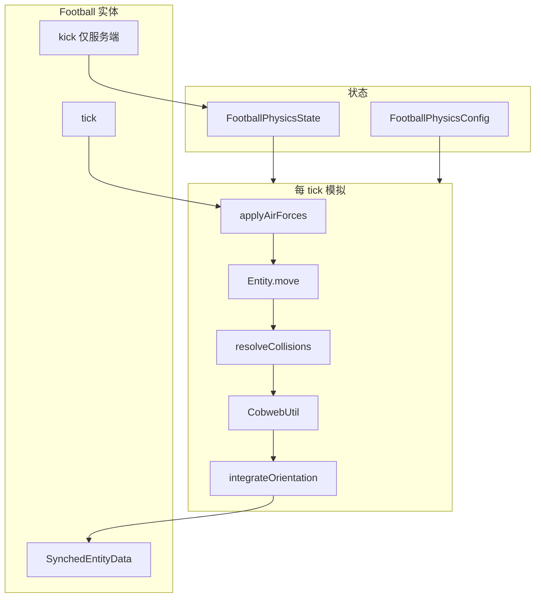
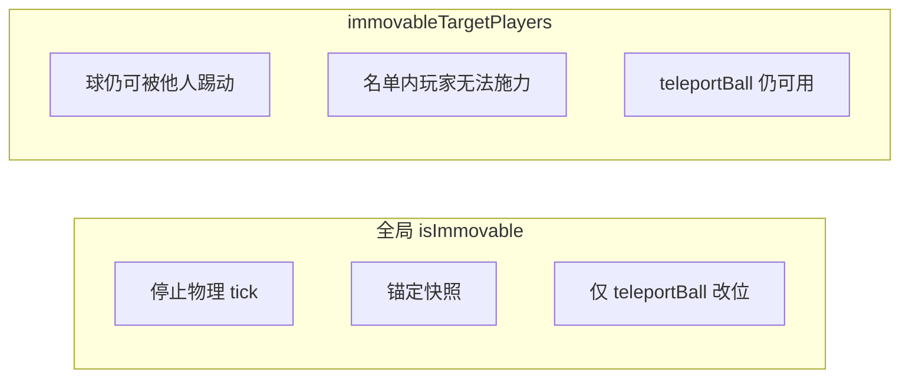
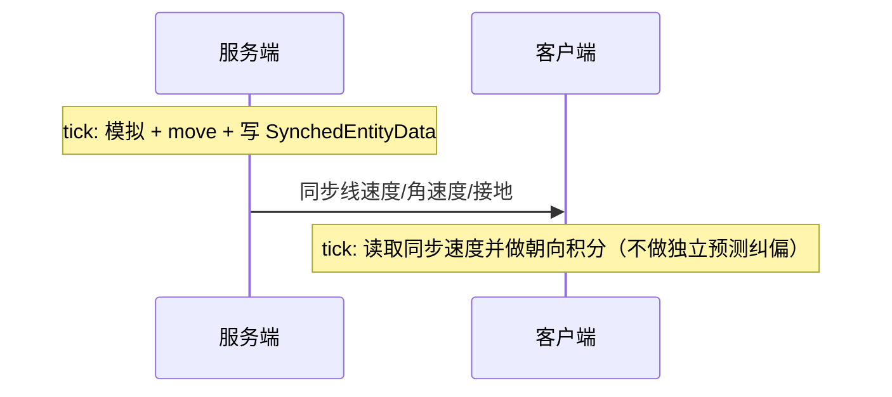
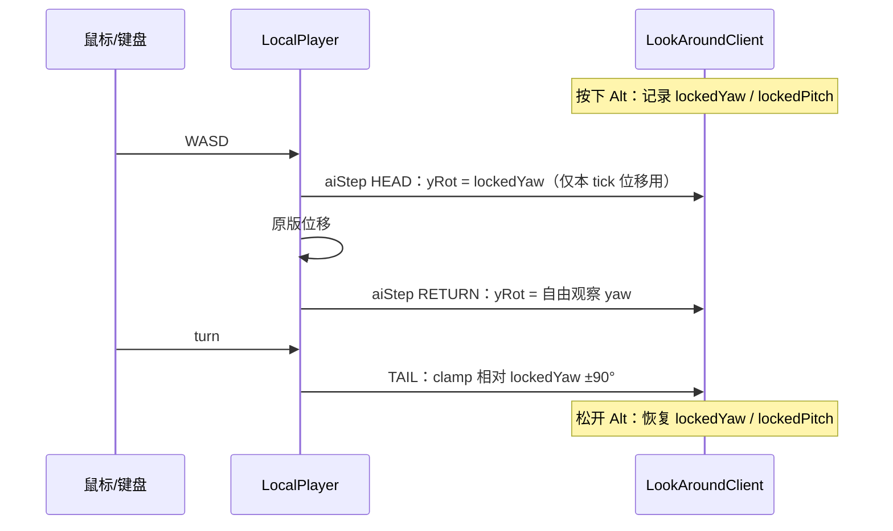

# 足球物理模拟原理

本文档说明 NMBCT Football 模组中足球实体（`Football`）的物理模拟设计、每 tick 的计算流程，以及服务端与客户端的协作方式。比赛流程与体力 HUD 见 [FOOTBALL_MATCH.md](./FOOTBALL_MATCH.md)；模组概览与默认按键见 [README.md](./README.md)。

## 设计目标

- **自定义刚体运动**：不依赖原版实体重力与速度积分，由模组自行维护线速度与角速度。
- **完整方块碰撞**：位移通过 `Entity.move(MoverType.SELF, …)` 完成，复用 Minecraft 的 AABB 与方块碰撞检测。
- **可踢、可弹、可滚**：支持偏心踢球（产生扭矩）、地面弹性、摩擦与滚动耦合。
- **球门网（蜘蛛网）**：球进入蜘蛛网区域时显著减速，可用于两端球门。
- **多人同步**：服务端权威；客户端读取同步速度并积分朝向，不再本地重复位移模拟。

## 架构概览

物理计算集中在 `util` 与 `physics` 包；`Football` 实体负责 Minecraft 生命周期、碰撞、`move` 调用与网络同步。



### 源码结构

| 路径                                       | 职责                        |
|------------------------------------------|---------------------------|
| `physics/FootballPhysicsState.kt`        | 线速度、角速度、接地/蛛网标志、视觉朝向（四元数） |
| `physics/FootballPhysicsConfig.kt`       | 质量、弹性、摩擦、重力等可调常量          |
| `util/FootballPhysicsSimulator.kt`       | 踢球、空气力、碰撞入口、朝向积分、滚动方向     |
| `util/CollisionUtil.kt`                  | 地面反弹、摩擦、墙体衰减、滚动耦合         |
| `util/CobwebUtil.kt`                     | 检测 AABB 是否与蜘蛛网相交并施加阻力     |
| `util/Vec3Math.kt` / `QuaternionMath.kt` | 向量与旋转工具                   |
| `FootballImmovableSnapshot.kt`           | 全局固定（`isImmovable`）时的位置与物理锚点 |
| `Football.kt`                            | `tick`、`kick`、同步、存档、移动限制 API |

## 状态变量

`FootballPhysicsState` 在服务端与客户端各有一份本地副本（客户端仅用于渲染朝向积分）。

| 字段                | 含义                       | 是否同步到客户端              |
|-------------------|--------------------------|-----------------------|
| `linearVelocity`  | 线速度（blocks/tick）         | 是（`DATA_LINEAR_VEL`）  |
| `angularVelocity` | 角速度向量；方向为转轴，模长为 rad/tick | 是（`DATA_ANGULAR_VEL`） |
| `onGround`        | 本 tick 是否视为接地            | 是（`DATA_ON_GROUND`）   |
| `inCobweb`        | 本 tick 是否在蜘蛛网内           | 否（本地每 tick 重算）        |
| `orientation`     | 渲染用四元数朝向                 | 否（由角速度在两端分别积分）        |

实体初始化时设置 `setNoGravity(true)`，避免与自定义重力叠加；`requiresPrecisePosition = true` 以减少原版位置插值与自定义物理冲突。

### 实体数据（`SynchedEntityData`，双端同步）

除物理状态外，`Football` 还通过实体数据同步下列字段（服务端写入，客户端只读）：

| 访问器 | 类型 | 默认值 | 是否写入存档 | 说明 |
|--------|------|--------|--------------|------|
| `DATA_LINEAR_VEL` | `Vector3f` | `0` | 是（`lv_*`） | 线速度 |
| `DATA_ANGULAR_VEL` | `Vector3f` | `0` | 是（`av_*`） | 角速度 |
| `DATA_ON_GROUND` | `Boolean` | `false` | 是（`on_ground`） | 接地 |
| `DATA_HOLDER_ID` | `Int` | `-1` | 否 | 持球守门员实体 ID |
| `DATA_IMMOVABLE` | `Boolean` | `false` | 是（`immovable`） | 全局固定，见下文 |
| `DATA_IMMOVABLE_TARGET_PLAYERS` | `Set<UUID>` | `emptySet()` | **否** | 按玩家禁止动球名单，见下文 |

`DATA_IMMOVABLE_TARGET_PLAYERS` 使用 Fabric 注册的自定义 `EntityDataSerializer<Set<UUID>>`（`FriendlyByteBuf` + `UUIDUtil.STREAM_CODEC` 读写集合），在 `NMBCTFootball.onInitialize` 中调用 `Football.registerSerializers()` 完成注册。

## 每 tick 计算流程

以下顺序在 **服务端** `Football.serverTick()` 中执行；客户端每 tick 从 `SynchedEntityData` 读取线速度/角速度，仅积分 `orientation`。

若 `isImmovable == true`，服务端在持球检查后直接走 `tickImmovable()`：从 `FootballImmovableSnapshot` 恢复位置与物理量、清零 `deltaMovement` 并同步，**不执行**下述位移与碰撞模拟。客户端在 `clientTick()` 开头同样若全局固定则强制渲染速度为零并提前返回。

### 1. 空气力与重力（`applyAirForces`）

在位移**之前**对线速度、角速度做欧拉步进：

1. **重力**：`v_y ← v_y - GRAVITY`（默认 `0.04` blocks/tick²）
2. **空气阻力**：`v ← v × AIR_DRAG`（默认 `0.99`/tick）
3. **自转衰减**：`ω ← ω × SPIN_DRAG`（默认 `0.995`/tick）

### 2. 位移与碰撞检测（`move`）

```text
deltaMovement = linearVelocity
move(MoverType.SELF, linearVelocity)
```

`move` 会更新实体位置，并设置 `horizontalCollision`、`verticalCollisionBelow`、`onGround()` 等标志，供下一步使用。方块台阶、墙体、地面均由原版碰撞系统处理。

### 3. 碰撞响应（`CollisionUtil.resolveCollisions`）

根据 `move` 结果修正速度（不再次移动位置）：

| 条件                    | 处理                                                   |
|-----------------------|------------------------------------------------------|
| 接地且 `v_y < 0`         | 竖直反弹：`v_y ← -v_y × RESTITUTION`                      |
| 接地                    | 水平摩擦：`v_x, v_z × GROUND_FRICTION`；角速度 `ω × GROUND_SPIN_FRICTION`；双向滚动耦合 |
| `horizontalCollision` | 对比本 tick **意图位移**与**实际位移**：被挡轴的速度分量沿墙法向反射（`v ← -v × WALL_RESTITUTION`），擦墙轴仅衰减 |
| 贴墙几乎不动              | 跳过滚动耦合，并对 `ω` 施加 `STUCK_SPIN_DRAG`，避免从自转持续泵入线速度 |

**滚动耦合**（接地且未贴墙卡住时）：无滑滚动近似下，水平线速度与角速度应满足：

```text
v_x ≈ -r · ω_z
v_z ≈  r · ω_x
```

其中 `r` 为 `RADIUS`（`0.25`）。每 tick **双向**拉近线速度与水平自转（`ROLL_COUPLING`，默认 `0.15`），避免只把 `ω` 灌进 `v` 导致越滚越快。水平速度低于 `STOP_SPEED_SQR` 时清零水平 `v` 与水平 `ω`。

### 4. 蜘蛛网阻力（`CobwebUtil`）

若实体 AABB 与任意 `Blocks.COBWEB` 方块相交，对速度施加每 tick 乘数（与原版蜘蛛网量级一致）：

| 分量              | 系数       |
|-----------------|----------|
| 水平 `v_x`, `v_z` | `× 0.25` |
| 竖直 `v_y`        | `× 0.05` |
| 角速度 `ω`         | `× 0.5`  |

自定义物理不会自动读取原版 `stuckSpeedMultiplier`，因此必须显式实现上述逻辑，球门网方可生效。

### 5. 姿态积分（`integrateOrientation`）

用当前 `angularVelocity` 对四元数 `orientation` 做小步旋转积分（`QuaternionMath.integrate`），供客户端渲染插值。渲染时在 tick 初将 `previousOrientation` 设为积分前的朝向，再用 `slerp` 做 `partialTick` 插值。

### 6. 写回与同步

- `deltaMovement = linearVelocity`（便于原版速度相关数据包）
- **仅服务端**：`entityData` 写入线速度、角速度、`onGround`

## 踢球（`kick`）

仅在**服务端**调用；客户端通过同步数据看到结果。

```text
冲量 F = direction × KICK_FORCE_SCALE   // direction 模长 = 命令 force；默认 scale=0.18
Δv = F / MASS
Δω = (kickPoint - 球心) × F / INERTIA
```

`force=1` 时线速增量约 **0.4 blocks/tick**（原先约 2.2）；`force=3` 约 1.2，适合中等射门力度。

- `kickPoint`：力的作用点（世界坐标）；水平方向在球心后方偏移一个半径。命令 `height` 为相对球心的竖直偏移（格，0=赤道）；偏高/偏低会在水平踢球时产生额外滚动扭矩（仍抑制绕 Y 轴偏航）。
- 踢球后根据水平线速度设置 **滚动自转** `ω_x = v_z/r`、`ω_z = -v_x/r`，`ω_y = 0`。
- `direction`：冲量向量，其长度即“力”的大小。

踢球后立即同步 `SynchedEntityData` 并调用 `syncPacketPositionCodec`。

**与移动限制的关系**：若 `lastKicker` 在 `immovableTargetPlayers` 内，则 `kick` 直接返回（不施加冲量）。命令踢球（`FootballKickUtil.applyPreciseCommandKick` / `applyCommandKick`）传入 `ignoreImmovableTargets = true`，不受名单影响。停球 `trap()` 同样依据 `lastKicker` 判断。

## 球体固定与按玩家移动限制

模组提供两层互不替代的约束：**全局固定**影响整颗球；**按玩家名单**只禁止名单内玩家对球施力，其它玩家与物理模拟照常。



### 全局固定：`isImmovable`

| 项目 | 行为 |
|------|------|
| 设置 | 服务端 `football.isImmovable = true`；写入 `DATA_IMMOVABLE` |
| 物理 | 每 tick `restoreImmovableSnapshot()`，球位、线/角速度、朝向、接地、墙弹冷却回到启用瞬间的快照 |
| 交互 | 不可踢、不可推、不可持球；`Entity.push` 对玩家无效 |
| 改位 | **`teleportBall` / `teleportBallCenter`** 可改位置；若仍固定，会 `captureImmovableSnapshot()` 更新锚点 |
| 存档 | `readAdditionalSaveData` / `addAdditionalSaveData` 读写 NBT 键 `immovable` |
| 客户端 | 渲染速度强制为 0，不做朝向积分外的位移外推 |

启用固定时会 `releaseHold()` 并捕获快照；关闭时丢弃快照。

### 按玩家名单：`immovableTargetPlayers`

| 项目 | 行为 |
|------|------|
| 数据 | `Set<UUID>`，经 `DATA_IMMOVABLE_TARGET_PLAYERS` **仅网络同步**，**不**写入 `AdditionalSaveData` |
| 查询 | `isPlayerBallMovementForbidden(player)` ⇔ `player.uuid ∈ immovableTargetPlayers` |
| 便捷 API | `makePlayerImmovable` / `makePlayersImmovable`（追加 UUID）；`makePlayerMovable` / `makePlayersMovable`（从集合移除） |
| 物理 | **不**停止 `serverTick` 模拟；球仍受重力、碰撞、他人踢球等影响 |
| 改位 | **`teleportBall` 不受名单限制**（与全局固定相同，属显式传送） |

名单内玩家被拦截的交互（服务端）：

- `kick` / `trap`（依据 `lastKicker`）
- `applyDribbleAssist`、`enterHold`、`dropAt`
- `applyPlayerPushesBeforeMove`、`applyPlayerPushFromPlayer`
- `resolvePlayerCollisions` 中对该玩家的推球、碰撞修正与球速反射（`suppressBodyInteraction`）
- `Entity.push` 来自该 `ServerPlayer`

**未**拦截：其它玩家的踢球与推球；命令踢球（`ignoreImmovableTargets`）；非玩家实体；球撞向名单内玩家时，玩家仍可能获得 recoil（只禁止该玩家**使球动**）。

将某 UUID 加入名单时，若其正持球（`holderEntityId` 对应该玩家），会立即 `releaseHold()`。

**客户端**：`FootballOperabilityClient.nearestOperableFootball` 会过滤 `isPlayerBallMovementForbidden` 的球，避免对本地玩家显示无效按键高亮。

### 二者对比

| | `isImmovable` | `immovableTargetPlayers` |
|---|----------------|---------------------------|
| 作用对象 | 所有人 | 仅集合内 UUID 对应玩家 |
| 球是否仍模拟 | 否（锚定） | 是 |
| 他人能否踢球 | 否 | 是 |
| 存档 | 是 | 否 |
| 双端同步 | `DATA_IMMOVABLE` | `DATA_IMMOVABLE_TARGET_PLAYERS` |

## 滚动方向（`getRollingDirection`）

返回**水平单位向量**（Y = 0），长度为 0 时返回 `Vec3.ZERO`。优先级如下：

1. 若水平线速度足够大 → 归一化 `(v_x, 0, v_z)`
2. 若接地且线速度很小但有自转 → 由 `ω` 推导无滑滚动方向：`(-r·ω_z, 0, r·ω_x)`
3. 若仍不足 → 使用 `up × ω` 的水平分量
4. 否则 → `ZERO`

可用于玩法逻辑（例如判断球向哪边滚、是否进门等）。

## 服务端与客户端



| 侧       | 行为                                                                                                    |
|---------|-------------------------------------------------------------------------------------------------------|
| **服务端** | 权威模拟；`kick` 仅在此执行；每 tick 写入 `SynchedEntityData`（含速度、`isImmovable`、`immovableTargetPlayers`） |
| **客户端** | 每 tick 读取同步速度；读取 `immovableTargetPlayers` 用于操作提示过滤；`isImmovable` 时渲染速度归零；否则用 `xOld + v·partialTick` 外推位置、`ω·partialTick` 积分朝向 |

`orientation` 不同步：两端各自用相同 `angularVelocity` 积分，在一般情况下与预测一致。

## 存档

`readAdditionalSaveData` / `addAdditionalSaveData` 持久化：

- `lv_x/y/z`：线速度
- `av_x/y/z`：角速度
- `on_ground`：接地标志
- `immovable`：是否全局固定（`isImmovable`）

**不**写入存档、仅依赖实体数据同步的字段：`immovableTargetPlayers`、`DATA_HOLDER_ID`。世界重载后名单与持球状态以服务端运行时为准；若需持久化名单，须在玩法层（如比赛状态）自行保存并在生成足球后重新设置。

### 代码示例（服务端）

```kotlin
// 全局固定（开球摆位、死球等）
football.isImmovable = true
football.teleportBallCenter(kickoffCenter)
football.isImmovable = false

// 仅禁止某队/某球员触球（例如开球前非发球方）
football.makePlayersImmovable(teamPlayers)
football.makePlayerMovable(kickoffPlayer)

// 或直接操作集合
football.immovableTargetPlayers = setOf(playerA.uuid, playerB.uuid)
```

## 参数调优

所有常量定义在 [`FootballPhysicsConfig.kt`](src/main/kotlin/net/astrorbits/football/physics/FootballPhysicsConfig.kt)，字段均附有中文 KDoc。常见调参方向：

| 现象       | 可调整项                                            |
|----------|-------------------------------------------------|
| 弹跳太高/太低  | `RESTITUTION`                                   |
| 地面滚不远    | `GROUND_FRICTION`（增大）、`ROLL_COUPLING`（增大）       |
| 空中飞太远    | `AIR_DRAG`（减小）、`GRAVITY`（增大）                    |
| 球门网太粘/太滑 | `COBWEB_HORIZONTAL_DRAG`、`COBWEB_VERTICAL_DRAG` |
| 撞墙反弹太强   | `WALL_RESTITUTION`                              |

## 与原版行为的差异

- **不使用**原版 `applyGravity()`；重力在 `applyAirForces` 中手动施加。
- **不依赖**原版蜘蛛网对 `deltaMovement` 的修改；蛛网效果由 `CobwebUtil` 显式处理。
- 速度以 `FootballPhysicsState.linearVelocity` 为准；`move` 之后可能微调该状态，并写回 `deltaMovement` 以兼容数据包。

## 相关命令与物品（便于测试）

- `/football summon`：在命令来源处生成足球
- `/football kick help`：查看踢球命令帮助
- `/football kick simple [power] [elevation]`：简单踢球（方向由执行朝向决定）
- `/football kick entity <target> simple ...`：对指定足球简单踢球
- `/football kick precise at <x> <y> <z> toward <x> <y> <z> power <p>`：精确踢球（踢球点 + 目标点定方向，power 定大小）
- `/football kick entity <target> precise ...`：对指定足球精确踢球
- 足球物品右键：在瞄准方块表面放置足球实体

## 客户端渲染

足球实体使用 **物品模型 + 物理四元数** 绘制，不在渲染器内重复积分角速度。

- **资源**：`assets/nmbct-football/models/item/football.json` 等，经 `ItemModelResolver.updateForNonLiving(..., ItemDisplayContext.GROUND, entity)` 解析为 `ItemStackRenderState`。
- **位置**：静止时（|v|² < `RENDER_STATIONARY_SPEED_SQR`）用原版 `getPosition` 插值；运动时用 `xOld + v·partialTick` 外推。
- **朝向**：`getOrientation(partialTick)` 从 `previousOrientation` 按 `ω·partialTick` 积分。
- **矩阵栈**：`PoseStack.use { }`（`client/PoseStackExtensions.kt`）包裹平移与旋转，避免遗漏 `popPose`。
- **管线（MC 26.1+）**：实体渲染走 `submit` + `SubmitNodeCollector`，物品层调用 `ItemStackRenderState.submit`；Y 偏移为碰撞半径 `RADIUS`（0.25），与 AABB 中心对齐。
- **远近 LOD**：`FootballRenderer` 根据与相机距离决定绘制方式——近处 3D 物品模型，远处改为始终面向相机的面片（`football_billboard.png`），以减轻远处三角面开销。

若模型偏移或大小不对，优先调 `FootballRenderer` 内 `translate` 或 `ItemDisplayContext`；若旋转与运动不一致，应检查 `Football.tick` 中的 `integrateOrientation` 与同步，而非渲染器。

### 客户端渲染距离（仅本机）

下列参数定义在 [`FootballClientConfig.kt`](src/main/kotlin/net/astrorbits/football/config/client/FootballClientConfig.kt)，通过 YACL 客户端配置界面调节（Mod Menu → 客户端配置 →「渲染」分组），**只影响本机绘制**，不改变服务端物理或实体同步范围。

| 配置键（存档字段） | 代码字段 | 默认值 | 含义 |
|-------------------|----------|--------|------|
| `ball_render_dist` | `ballRenderDist` | `128` | 足球最远渲染距离（格）。相机到球心距离超过该值时，客户端不再绘制该足球。 |
| `ball_billboard_ratio` | `ballBillboardRatio` | `0.62` | 面片切换比例（0~1）。面片切换距离 = `ball_render_dist × ball_billboard_ratio`；比例越小，越早从 3D 模型切换为面片。 |

**判定逻辑**（`FootballRenderer`）：

```text
distance = 相机到球心（含 MODEL_Y_OFFSET）的距离
若 distance > ball_render_dist → 不渲染
若 distance > ball_render_dist × ball_billboard_ratio → 面片渲染
否则 → 3D 物品模型渲染
```

示例：默认 `128` 格、`0.62` 时，约 **79.4** 格外开始用面片，**128** 格外完全不可见。

> **注意**：服务端足球实体注册为 `clientTrackingRange(128)`（`Football.kt`）。若把 `ball_render_dist` 调得大于同步跟踪距离，远处可能仍收不到实体数据，客户端同样无法渲染。调参时建议两者大致对齐或渲染距离略小于跟踪距离。

## 守门员：`R` 键蓄力鱼跃扑救

该机制对应守门员未持球时的 `GK_DIVE`：

- 客户端按住 `R`（踢球键）开始蓄力，松开时发送 `chargeHeldMs / chargeRatio` 与当前 `lookYaw/lookPitch`。
- 鱼跃蓄力为**线性满格**（`KickChargeUtil.computeLinearRatio`），无完美窗口、无过头衰减；蓄力中按**带球键**（与场员相同键位）可打断蓄力，且不触发带球逻辑。
- 服务端以**动作瞬间视角**（`lookYaw` / `lookPitch`）计算前扑方向；前扑距离与起跳高度还随**俯仰角**变化（见下）。
- 前扑距离与高度随蓄力提升；鱼跃期间每 tick 写入水平速度并同步客户端。
- 鱼跃会话持续 `goalkeeper.dive.dive_duration_ticks`，期间每 tick 进行扑救判定。
- 扑救判定使用 [`GoalkeeperUtil.canDiveCatchBall`](src/main/kotlin/net/astrorbits/football/util/GoalkeeperUtil.kt)（**动作瞬间** `lookYaw` / `lookPitch`），不再仅用水平扇形：
  - **远距**：以 `diveCatchOrigin`（眼高比例 `goalkeeper.dive.dive_catch_origin_eye_scale`）为原点，在**三维视线方向**上的锥体内（半角 `goalkeeper.dive.dive_half_angle_deg`，高球可叠加 `dive_high_ball_extra_half_angle_deg`），距离 ≤ `dive_range`（潜行 + `crouch_range_bonus`）。
  - **近身**（水平距离 &lt; `dive_close_range`）：放宽为脚线以下 / 头顶以上的竖直带（`dive_close_vertical_below_feet`、`dive_close_vertical_above_head`），且球不得在身后。
  - 来球速度超过 `dive_catch_max_speed` 时不接（与站立接球上限一致，默认 `2.2` blocks/tick）。
- **蓄力体力**（`stamina_mechanism.action_costs`，见 [FOOTBALL_MATCH.md](./FOOTBALL_MATCH.md)）：满蓄力保持超过 `gk_dive_full_charge_hold_drain_delay_ticks` 后，客户端每 tick 发 `GK_DIVE_CHARGE_DRAIN` 按 `gk_dive_full_charge_hold_drain_per_second` 扣体；带球键打断蓄力发 `GK_DIVE_CHARGE_CANCEL`，一次性扣 `gk_dive_charge_cancel_cost`。
- 命中后直接抱球（`enterHold`），并立刻处理“后坐力 + 前扑减速”。

### 起跳速度（蓄力 × 俯仰）

设蓄力比 `c ∈ [0,1]`，`GK_DIVE_SPEED = goalkeeper.dive.dive_speed`，俯仰与冲量自 `goalkeeper.dive.pitch` / `goalkeeper.dive.impulse` 读取（见 `GoalkeeperDivePitchSettings`、`GoalkeeperDiveImpulseSettings`）。

`GoalkeeperUtil.resolveDivePitchScalars(lookPitch)` 得到 `heightScale`、`forwardScale`、`groundedDive`、`groundVerticalSpeed`（Minecraft 俯仰：负=仰视，正=俯视）：

| 俯仰区间 | 高度系数 | 水平系数 | 模式 |
|----------|----------|----------|------|
| 仰视（pitch &lt; 0） | 1.0 → `look_up_max_height_scale` | 1.0 → `look_up_min_forward_scale` | 参考角 `look_up_reference_pitch_deg` |
| 平视 → `ground_pitch_threshold_deg` | 1.0 → `ground_height_scale` | 1.0 → `ground_forward_scale` | 同步降低 |
| 俯视 &gt; 阈值 | `ground_height_scale` | `ground_forward_scale`（最短档） | `groundedDive`，竖直 `ground_vertical_speed` |

```text
imp = goalkeeper.dive.impulse
baseH = lerp(imp.launch_up_min, imp.launch_up_max, c) * heightScale
baseF = lerp(GK_DIVE_SPEED * imp.launch_forward_min_scale,
              GK_DIVE_SPEED * imp.launch_forward_max_scale, c) * forwardScale
sustainF = lerp(GK_DIVE_SPEED * imp.sustain_forward_min_scale,
                GK_DIVE_SPEED * imp.sustain_forward_max_scale, c) * forwardScale
起跳竖直 = groundedDive ? pitch.ground_vertical_speed : baseH
hurtMarked = true
```

### 接球后坐力与减速

设来球线速度为 `v_ball`（`football.linearVelocity`），`|v_ball|` 为球速，接球瞬间：

```text
若 |v_ball| < GK_DIVE_CATCH_RECOIL_MIN_SPEED:
    recoil = 0
否则:
    recoilRaw = v_ball * (GK_DIVE_DEFLECT_FORCE_SCALE * 0.2)
    recoil    = clampMagnitude(recoilRaw, 0.75)
```

`GK_DIVE_CATCH_RECOIL_MIN_SPEED` 对应配置 `goalkeeper.dive.dive_catch_recoil_min_speed`（默认 `0.25` blocks/tick）。

然后对守门员当前速度做分解：

```text
v_forward  = project(player.deltaMovement, diveForwardDir)
v_remain   = player.deltaMovement - v_forward
v_new      = v_remain + v_forward * 0.15 + recoil
```

- 低速来球不施加 `recoil`，避免静止/滚地球仍被轻微弹开。
- 达到阈值后，`recoil` 与来球方向一致，模拟接球冲击（后坐）。
- 将前扑分量缩到 `15%`，显著减少接球后继续向前“滑冲”的情况（与球速无关，每次鱼跃接球都会执行）。

### 站立 `X` 接球后坐力（GK_CATCH）

守门员普通 `X` 接球（`GK_CATCH`）与鱼跃接球复用同一后坐力计算：

- 阈值仍是 `goalkeeper.dive.dive_catch_recoil_min_speed`（默认 `0.25`）。
- 后坐力仍由来球速度与 `goalkeeper.dive.dive_deflect_force_scale` 计算并限幅（上限 `0.75`）。
- 接球后同样进行“前向分量衰减 + recoil 叠加”，只是前向基准方向改为当前视角水平方向。

这保证了鱼跃接球与站立接球在“低速不弹、快速来球有后坐”上的手感一致。

## 滑铲（`C` 键，冲刺时）

服务端权威，逻辑在 [`SlideTackleSessions`](src/main/kotlin/net/astrorbits/football/input/SlideTackleSessions.kt)；**体力**在 `stamina_mechanism.action_costs`，**位移/冷却**在 `player_input.slide`（`PlayerSlideTackleSettings`）。

### 触发与约束

- 默认键 **C**（`slide_tackle`），须 **疾跑且在地**；连续疾跑至少 `slide_min_sprint_ticks`（默认 `5`）后才可起手。
- 起手方向为 [`FootballKickUtil.resolveDribbleDirection`](src/main/kotlin/net/astrorbits/football/util/FootballKickUtil.kt)（与带球同基准，含观察四周锁定 yaw）。
- 起手立刻扣 `slide_tackle_entry_cost`（须 ≤ 当前体力且 ≤ `slide_tackle_max_total_cost`）；滑铲进行中按 tick 从 `slide_tackle_sustain_cost` 预算扣体（预算 = `max(0, max_total − entry)`，在 `slide_decay_ticks` 内摊完），体力不足或预算耗尽则结束。
- **冷却**：上次滑铲结束后 `slide_tackle_cooldown_seconds`（默认 `3s`）内不可再铲；客户端经 `SlideTackleStateS2CPayload` 同步冷却结束 tick。
- **可与带球并存**：滑铲 session 独立于带球 session，不强制结束带球。

### 位移曲线

- 初速 `slide_initial_speed`（默认 `1.05` blocks/tick），前 `slide_initial_hold_ticks` 保持，再在 `slide_decay_ticks` 内衰减至 0。
- 最短持续 `min_slide_ticks`（默认 `8`）；结束后保留 `slide_end_speed_retain`（默认 `85%`）的水平速度，**不再**清零 `deltaMovement`。
- 滑铲期间 `effectiveHorizontalVelocity` 供 [`Football`](src/main/kotlin/net/astrorbits/football/Football.kt) 球体碰撞在实体 tick 前采样。

### 撞人与被撞

与下文「滑铲撞人」相同；参数现位于 `player_input.slide`（不再放在 `player_input.collision`）。

## 加速疾跑（`Z` 键）

[`BoostSprintState`](src/main/kotlin/net/astrorbits/football/stamina/BoostSprintState.kt) 服务端权威；客户端 [`BoostSprintClient`](src/client/kotlin/net/astrorbits/football/client/BoostSprintClient.kt) 处理按键。

| 项 | 说明 |
|----|------|
| 按键 | 默认 **Z**（`boost_sprint`） |
| 开启条件 | 疾跑、有向前移动意图、体力 &gt; 0 |
| 移速 | `stamina_mechanism.action_costs.boost_sprint_speed_multiplier`（默认 `2.0`，`ADD_MULTIPLIED_TOTAL`） |
| 体力 | 疾跑消耗 × `boost_sprint_stamina_drain_multiplier`（默认 `3`） |
| 客户端模式 | `FootballClientConfig.boost_sprint_input_mode`：**切换**（再按关闭）或 **按住**（默认 **按住**） |
| 同步 | `BoostSprintToggleC2SPayload`；`StaminaSyncS2CPayload.boostSprintActive` |
| 表现 | 粒子尾迹；[`BoostSprintHudElement`](src/client/kotlin/net/astrorbits/football/client/render/BoostSprintHudElement.kt) 屏幕紫晕 + 体力条上方图标（`boost_sprint.png`，可调 `ICON_SCALE` / 平移）；本地音效 `player.boost_sprint.start` / `end` |

松开按键、停止疾跑、无向前意图或体力耗尽会自动关闭；创造/旁观不生效。

## 带球视野外指示

带球且足球不在屏幕内时，[`DribbleBallOffscreenHudElement`](src/client/kotlin/net/astrorbits/football/client/render/DribbleBallOffscreenHudElement.kt) 在屏幕边缘显示方向箭头 + 小足球图标（`textures/item/football_32x.png`）。

- 跟踪：[`DribbleBallIndicatorClient`](src/client/kotlin/net/astrorbits/football/client/DribbleBallIndicatorClient.kt) 在 `DRIBBLE_HOLD` 时绑定最近足球实体。
- **主路径**（\|pitch\| &lt; 85°）：水平罗盘分箱（前/后/左/右）+ 视平面上下选边（前/后：上→顶边、下→底边；左/右：上/下半缘）+ 沿边比例 `u`；箭头方向 **屏幕中心 → 边缘点**；足球图标在箭头**尾部**（靠屏幕内侧）。
- **退化路径**（仰视/俯视）：相机空间方向打边缘后 **相对屏幕中心上下镜像**；路径切换时重置边缘平滑，避免瞬移。
- 箭头贴图：`textures/gui/sprites/hud/dribble_offscreen_arrow.png`（默认 11×11，绘制 16×16，尖端朝左，运行时旋转）。

带球目标距离默认 **`dribble_target_distance = 1.2`**（`player_input.dribble`）。

## 球员交互碰撞（新增）

为提升对抗与带球体验，足球与球员新增如下服务端权威交互：

1. **足球撞玩家时的双向作用**
   - 足球在接触法线方向做反弹修正（可配置恢复系数）。
   - 当来球法向速度达到阈值时，玩家会被沿接触方向推开一小段距离。
   - 推力与来球速度成比例，并有最大值钳制。
2. **带球碰撞豁免**
   - 玩家正在带球时，自己与该球忽略碰撞。
   - 带球结束后进入短暂 `grace` 窗口，仍忽略与“刚刚那颗球”的碰撞。
3. **滑铲撞人**
   - 滑铲命中其他玩家后，滑铲者当前速度会立即乘衰减系数（快速降速）。
   - 被铲者会沿滑铲方向被推开，并进入短时高阻力状态（水平速度每 tick 额外衰减）。

## 新增配置项（服务端 `nmbct-football-server.json`）

### `stamina_mechanism.action_costs`

嵌套在 `stamina_mechanism` 下，YACL 分组「动作体力消耗」。 [`StaminaState.tryConsume`](src/main/kotlin/net/astrorbits/football/stamina/StaminaState.kt) 为统一扣体入口。

| 字段 | 默认 | 说明 |
|------|------|------|
| `gk_dive_full_charge_hold_drain_delay_ticks` | `20` | 鱼跃满蓄力后延迟才开始持续扣体 |
| `gk_dive_full_charge_hold_drain_per_second` | `40` | 满蓄力保持期间每秒扣体 |
| `gk_dive_charge_cancel_cost` | `60` | 带球键打断鱼跃蓄力一次性扣体 |
| `slide_tackle_entry_cost` | `60` | 滑铲起手扣体（亦作最低起步体力） |
| `slide_tackle_sustain_cost` | `60` | 滑铲进行中至多再扣（在 `slide_decay_ticks` 内摊销） |
| `slide_tackle_max_total_cost` | `120` | 单次滑铲 entry+sustain 总和上限 |
| `boost_sprint_stamina_drain_multiplier` | `3` | 加速疾跑期间疾跑消耗倍率 |
| `boost_sprint_speed_multiplier` | `2` | 加速疾跑额外移速倍率 |

### `player_input.dribble`

| 字段 | 默认值 | 说明 |
|------|--------|------|
| `dribble_collision_grace_ticks` | `15` | 带球结束后继续忽略与刚带球体碰撞的 tick 数 |
| `dribble_target_distance` | `1.2` | 带球时球相对玩家的目标水平距离（方块） |

### `player_input.slide`（`PlayerSlideTackleSettings`）

| 字段 | 默认值 | 说明 |
|------|--------|------|
| `slide_tackle_cooldown_seconds` | `3` | 滑铲冷却（秒） |
| `min_slide_ticks` | `8` | 最短滑铲 tick |
| `slide_initial_speed` | `1.05` | 初速（blocks/tick） |
| `slide_initial_hold_ticks` | `6` | 初速保持 tick |
| `slide_decay_ticks` | `14` | 衰减 tick 数 |
| `slide_end_speed_retain` | `0.85` | 结束时水平速度保留比例 |
| `slide_min_sprint_ticks` | `5` | 起手前至少疾跑 tick |
| `slide_tackler_speed_damp_on_contact` | `0.25` | 铲到人后自身速度保留比例 |
| `slide_victim_push_speed` | `0.72` | 被铲瞬时推开速度 |
| `slide_victim_resistance_ticks` | `12` | 被铲高阻力 tick |
| `slide_victim_resistance_factor` | `0.35` | 高阻力每 tick 速度保留 |
| `slide_victim_jump_block_ticks` | `14` | 被铲禁止起跳 tick |
| `slide_ball_contact_grace_ticks` | `14` | 滑铲后与球碰撞豁免 tick |

### `player_input.collision`（球↔人，非滑铲专用）

| 字段 | 默认值 | 说明 |
|------|--------|------|
| `ball_player_recoil_min_speed` | `0.25` | 球撞玩家时，触发玩家位移的最小法向速度 |
| `ball_player_push_scale` | `0.2` | 球撞玩家推力与法向速度的比例系数 |
| `ball_player_max_push` | `0.75` | 球撞玩家推力最大值 |
| `ball_player_restitution` | `0.68` | 球撞玩家反弹恢复系数 |
| `player_ball_push_min_speed` | `0.06` | 玩家推球时，相对接近速度低于该值则不施加冲量 |
| `player_ball_push_scale` | `0.35` | 玩家推球冲量 = 相对接近速度 × 该系数 |
| `player_ball_push_max` | `0.55` | 玩家推球单次线速度增量上限（blocks/tick） |

### `goalkeeper` 扑救扩展（`behavior` / `dive`）

| 字段 | 默认 | 说明 |
|------|------|------|
| `dive_catch_max_speed` | `2.2` | 鱼跃/站立接球最大来球速度 |
| `dive_close_range` | `2.5` | 近身判定水平距离阈值 |
| `dive_high_ball_min_height` | `0.6` | 球心高于守门员眼高 + 该值（方块）时启用高球半角 |
| `dive_high_ball_extra_half_angle_deg` | `25` | 高球时在 `dive_half_angle_deg` 上叠加的半角（度） |
| `dive_close_vertical_below_feet` | `0.3` | 近身判定：允许球心在脚线以下该距离 |
| `dive_close_vertical_above_head` | `1.8` | 近身判定：允许球心在头顶以上该距离 |

调参建议：

- 若对抗过“粘”，优先降低 `slide_victim_resistance_ticks` 或提高 `slide_victim_resistance_factor`。
- 若球撞人过“硬”，先降低 `ball_player_push_scale`，再考虑下调 `ball_player_restitution`。
- 若带球仍偶发被自己球体挤动，可适当提高 `dribble_collision_grace_ticks`。
- 若推球太“轻/重”，优先调 `player_ball_push_scale` 与 `player_ball_push_max`；球越“沉”可略增 `physics.mass`。
- 滑铲体力：`entry + sustain` 不得超过 `slide_tackle_max_total_cost`；`entry` 亦为起手最低体力门槛。

### 玩家 ↔ 静止/慢速球（滚动推球）

`Football.resolvePlayerCollisions` 在服务端每 tick 处理，与方块碰撞、滚动耦合共用同一套 `FootballPhysicsState`。

**玩家推球（新增）**——玩家走近静止或慢速球时：

```text
basePushDir = normalize(球位置 − 玩家位置) 的水平分量
pushDir = basePushDir + 身体推球侧向偏移
v_rel = max(0, (v_player − v_ball) · pushDir)
Δv = min(v_rel × player_ball_push_scale / MASS, player_ball_push_max)
v ← v + pushDir × Δv
ω ← rollingAngularVelocity(v_horizontal, RADIUS)   // 无滑滚动，不是纯平移
```

- **惯性**：冲量除以 `MASS`（默认 `0.45`），与踢球 `Δv = F/MASS` 同一约定。
- **滚动**：立即用 `Vec3Math.rollingAngularVelocity` 同步 `ω_x`、`ω_z`；之后每 tick 接地时 `ROLL_COUPLING` 继续维持无滑关系，并由 `GROUND_FRICTION` 衰减。
- **刻意推偏**：普通移动身体推球会根据玩家移动方向与球相对位置加入侧向偏移；越是擦着球推，方向越容易偏向侧面。实现上在 `Football.applyBodyPushDeflection`：`pushDir` 沿移动方向的法向分量超过 `PLAYER_PUSH_DEFLECTION_DEADZONE`（`0.02`）时，按 `sign(side) × PLAYER_PUSH_DEFLECTION_BIAS × (0.45 + glancing×0.55)` 混入侧向（`glancing` 为推球方向与移动方向的夹角因子，`BIAS=0.62`）。这是为了让“靠身体顶球”不具备带球技能的稳定控球能力，鼓励使用带球功能。
- **分离**：MTV 把球推出玩家碰撞盒，避免嵌入。

**球撞玩家（原有）**——球速朝向玩家分量足够大时：

- 球沿法线反弹（`ball_player_restitution`）
- 玩家获得水平 recoil（`ball_player_push_scale` / `ball_player_max_push`）

两条链路独立：推球看玩家相对接近速度，撞人看球对玩家法向接近速度。

## 球员输入：观察四周（Look Around）

> **请勿随意修改本节描述的机制。**  
> 下列行为是**刻意设计**的玩法约定（含「观察时扭头」与「踢球仍跟当前视角」的分离），**不是**实现遗漏或待修 bug。  
> 若确需改版，请先与玩法设计对齐，并**同步更新本文档**；勿在代码评审中把「带球跟锁定朝向、射门跟当前视角」当成不一致而强行统一。

### 功能概要

默认按键为 **左 Alt**（`FootballKeyBindings.LOOK_AROUND`）。按住时可自由转动视角观察周围；松开时视角回到**按下瞬间**的 yaw / pitch。观察期间水平移动（WASD）以**按下键时**的身体朝向为基准，而非当前扭头方向。

| 模块 | 路径 |
|------|------|
| 客户端状态 | `client/key/LookAroundClient.kt` |
| 移动时锁定身体 yaw | `client/mixin/LocalPlayerMixin.java`（`aiStep` HEAD/RETURN + `turn` TAIL） |
| 扭头角度上限 | `LookAroundClient`：`±90°`（相对 `lockedYaw`） |
| 观察专用准心 | `client/render/LookAroundCrosshairHud.kt`，贴图 `textures/gui/sprites/hud/crosshair_look_around.png`（15×7） |
| 按键提示 HUD | `client/render/FootballKeybindHintHudElement.kt`（含常亮的「观察四周」行；聊天栏打开时仍显示） |

### 客户端：移动 vs 视角



- **移动基准**：`aiStep` 开头临时将 `yRot` / `yBodyRot` 设为 `lockedYaw`，位移计算结束后再恢复为自由观察朝向（`yHeadRot` 同步为观察 yaw）。
- **扭头限制**：在 `Entity.turn` 之后将 yaw 限制在 `lockedYaw ± 90°`。
- **其它客户端逻辑**（如带球发包前的「是否有移动输入」）使用 `LookAroundClient.movementYaw(player)`，与上述移动基准一致。

### 朝向基准：带球与其它操作（刻意分离）

**这是核心玩法设计，请勿改成「全部跟锁定 yaw」或「全部跟当前视角」。**

| 情境 | 使用的朝向 | 说明 |
|------|------------|------|
| 观察四周期间 **带球**（`DRIBBLE_HOLD`） | 进入观察四周时的 yaw（`dribbleBaseYaw`） | 球的目标点、推进方向按**按下 Alt 时**的朝向计算；扭头看球时球不应滑到身侧 |
| 观察四周期间 **传球 / 射门 / 停球 / 挑球** 等 | **当前**视角（`yHeadRot` 等） | 故意保留：可边观察边用**此刻**瞄准方向出脚 |
| 未按观察四周 | 各操作原有逻辑 | 带球、踢球均按当前朝向 / 移动输入 |

网络包约定（`FootballActionC2SPayload`）：

- 带球且观察中：设置 `FLAG_LOOK_AROUND`，`lookYaw` 为锁定 yaw（客户端 `LookAroundClient.movementYaw`）。
- 其它操作：**不**设置该标志，`lookYaw` 仍为当前头部朝向。

服务端带球链路：

1. `FootballDribbleSessions.beginOrRefresh`：若 `FLAG_LOOK_AROUND`，在 session 上记录 `dribbleBaseYaw`（首次进入观察时写入，观察期间保持）。
2. `FootballKickUtil.resolveDribbleDirection(player, dribbleBaseYaw)`：有移动输入时调用 `FootballMovementInputUtil.movementInputVector(player, dribbleBaseYaw)`，将客户端移动意图从服务端当前 `yRot`（多为观察中的扭头）**换算**到 `dribbleBaseYaw` 基准。
3. `FootballDribbleAssist.apply`：用上述方向计算球的目标位置与 PD 修正。

传球 / 射门等仍走 `handleKickAction` → `applyKickToFootball` / `applyKickToFootballWithLook`，**不**传入 `dribbleBaseYaw`，方向随**当前** `lookYaw`（刻意如此）。

### 修改时的自检清单

若你正在改观察四周或带球相关代码，请确认未破坏下列不变量：

- [ ] 松开 Alt 后视角回到按下时的 yaw / pitch。
- [ ] 观察中扭头不超过相对 `lockedYaw` 的 ±90°。
- [ ] 观察中 WASD 与带球方向均基于**进入观察时**的 yaw，而非当前扭头。
- [ ] 观察中传球 / 射门等仍基于**当前**视角（未误用 `dribbleBaseYaw`）。
- [ ] 仅 `DRIBBLE_HOLD` 路径设置 `FLAG_LOOK_AROUND` / `dribbleBaseYaw`。

---

*文档版本与代码同步；修改物理或上述输入逻辑时请一并更新本文档。*
