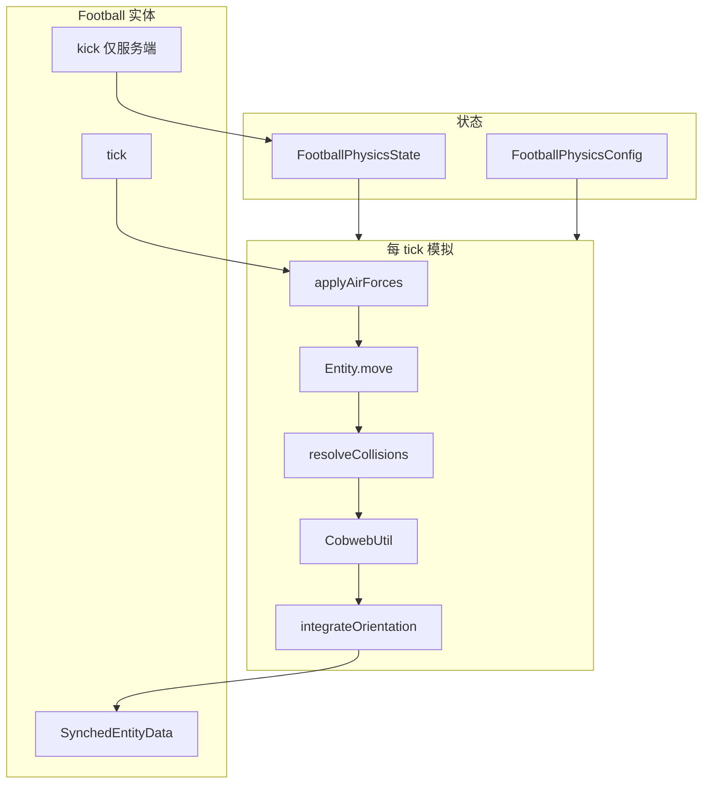
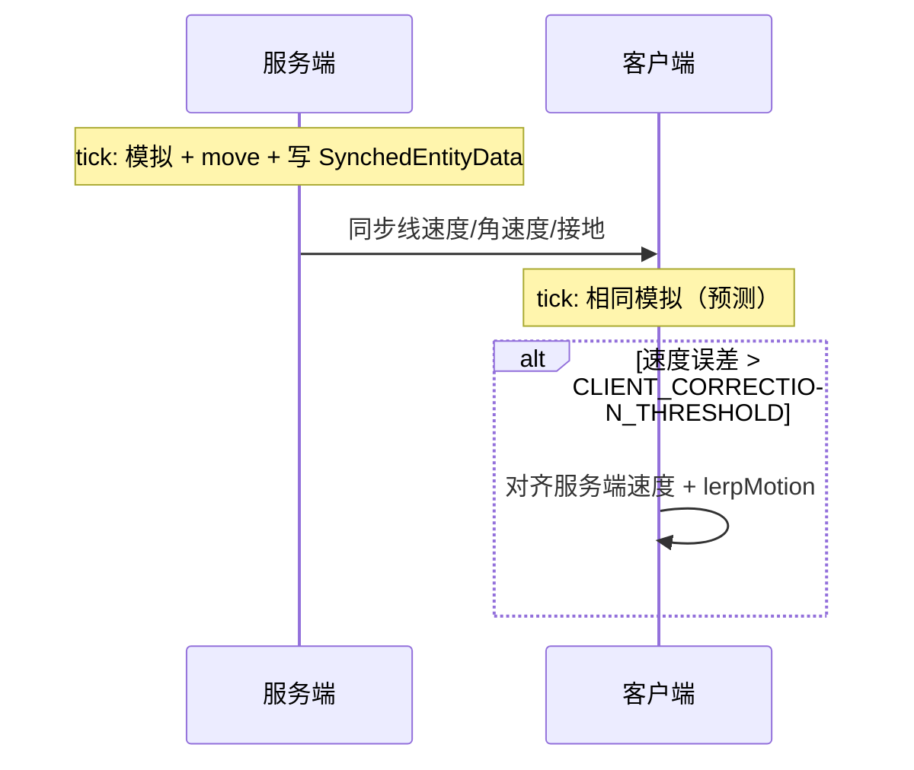
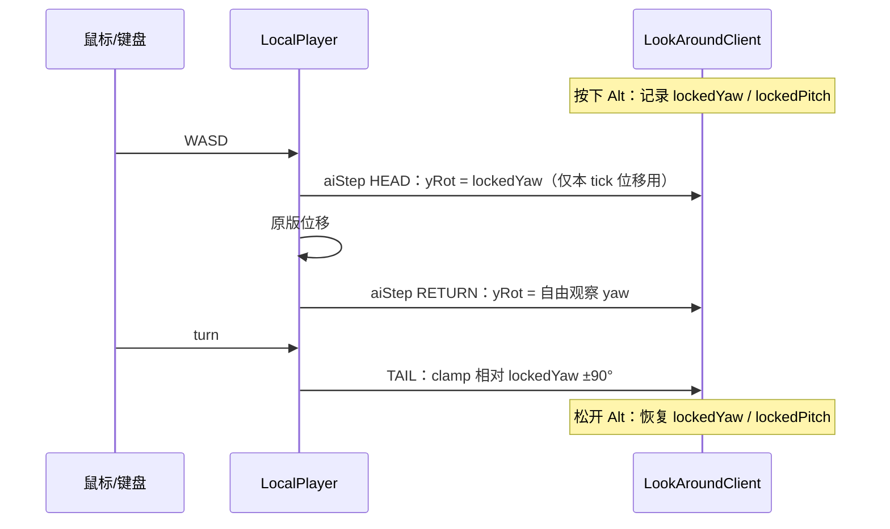

# 足球物理模拟原理

本文档说明 NMBCT Football 模组中足球实体（`Football`）的物理模拟设计、每 tick 的计算流程，以及服务端与客户端的协作方式。

## 设计目标

- **自定义刚体运动**：不依赖原版实体重力与速度积分，由模组自行维护线速度与角速度。
- **完整方块碰撞**：位移通过 `Entity.move(MoverType.SELF, …)` 完成，复用 Minecraft 的 AABB 与方块碰撞检测。
- **可踢、可弹、可滚**：支持偏心踢球（产生扭矩）、地面弹性、摩擦与滚动耦合。
- **球门网（蜘蛛网）**：球进入蜘蛛网区域时显著减速，可用于两端球门。
- **多人同步**：服务端权威；客户端读取同步速度并积分朝向，不再本地重复位移模拟。

## 架构概览

物理计算集中在 `util` 与 `physics` 包；`Football` 实体负责 Minecraft 生命周期、碰撞、`move` 调用与网络同步。



### 源码结构

| 路径                                       | 职责                        |
|------------------------------------------|---------------------------|
| `physics/FootballPhysicsState.kt`        | 线速度、角速度、接地/蛛网标志、视觉朝向（四元数） |
| `physics/FootballPhysicsConfig.kt`       | 质量、弹性、摩擦、重力等可调常量          |
| `util/FootballPhysicsSimulator.kt`       | 踢球、空气力、碰撞入口、朝向积分、滚动方向     |
| `util/CollisionUtil.kt`                  | 地面反弹、摩擦、墙体衰减、滚动耦合         |
| `util/CobwebUtil.kt`                     | 检测 AABB 是否与蜘蛛网相交并施加阻力     |
| `util/Vec3Math.kt` / `QuaternionMath.kt` | 向量与旋转工具                   |
| `Football.kt`                            | `tick`、`kick`、同步、存档       |

## 状态变量

`FootballPhysicsState` 在服务端与客户端各有一份本地副本（客户端仅用于渲染朝向积分）。

| 字段                | 含义                       | 是否同步到客户端              |
|-------------------|--------------------------|-----------------------|
| `linearVelocity`  | 线速度（blocks/tick）         | 是（`DATA_LINEAR_VEL`）  |
| `angularVelocity` | 角速度向量；方向为转轴，模长为 rad/tick | 是（`DATA_ANGULAR_VEL`） |
| `onGround`        | 本 tick 是否视为接地            | 是（`DATA_ON_GROUND`）   |
| `inCobweb`        | 本 tick 是否在蜘蛛网内           | 否（本地每 tick 重算）        |
| `orientation`     | 渲染用四元数朝向                 | 否（由角速度在两端分别积分）        |

实体初始化时设置 `setNoGravity(true)`，避免与自定义重力叠加；`requiresPrecisePosition = true` 以减少原版位置插值与自定义物理冲突。

## 每 tick 计算流程

以下顺序在 **服务端** `Football.serverTick()` 中执行；客户端每 tick 从 `SynchedEntityData` 读取线速度/角速度，仅积分 `orientation`。

### 1. 空气力与重力（`applyAirForces`）

在位移**之前**对线速度、角速度做欧拉步进：

1. **重力**：`v_y ← v_y - GRAVITY`（默认 `0.04` blocks/tick²）
2. **空气阻力**：`v ← v × AIR_DRAG`（默认 `0.99`/tick）
3. **自转衰减**：`ω ← ω × SPIN_DRAG`（默认 `0.995`/tick）

### 2. 位移与碰撞检测（`move`）

```text
deltaMovement = linearVelocity
move(MoverType.SELF, linearVelocity)
```

`move` 会更新实体位置，并设置 `horizontalCollision`、`verticalCollisionBelow`、`onGround()` 等标志，供下一步使用。方块台阶、墙体、地面均由原版碰撞系统处理。

### 3. 碰撞响应（`CollisionUtil.resolveCollisions`）

根据 `move` 结果修正速度（不再次移动位置）：

| 条件                    | 处理                                                   |
|-----------------------|------------------------------------------------------|
| 接地且 `v_y < 0`         | 竖直反弹：`v_y ← -v_y × RESTITUTION`                      |
| 接地                    | 水平摩擦：`v_x, v_z × GROUND_FRICTION`；角速度 `ω × GROUND_SPIN_FRICTION`；双向滚动耦合 |
| `horizontalCollision` | 对比本 tick **意图位移**与**实际位移**：被挡轴的速度分量沿墙法向反射（`v ← -v × WALL_RESTITUTION`），擦墙轴仅衰减 |
| 贴墙几乎不动              | 跳过滚动耦合，并对 `ω` 施加 `STUCK_SPIN_DRAG`，避免从自转持续泵入线速度 |

**滚动耦合**（接地且未贴墙卡住时）：无滑滚动近似下，水平线速度与角速度应满足：

```text
v_x ≈ -r · ω_z
v_z ≈  r · ω_x
```

其中 `r` 为 `RADIUS`（`0.25`）。每 tick **双向**拉近线速度与水平自转（`ROLL_COUPLING`，默认 `0.15`），避免只把 `ω` 灌进 `v` 导致越滚越快。水平速度低于 `STOP_SPEED_SQR` 时清零水平 `v` 与水平 `ω`。

### 4. 蜘蛛网阻力（`CobwebUtil`）

若实体 AABB 与任意 `Blocks.COBWEB` 方块相交，对速度施加每 tick 乘数（与原版蜘蛛网量级一致）：

| 分量              | 系数       |
|-----------------|----------|
| 水平 `v_x`, `v_z` | `× 0.25` |
| 竖直 `v_y`        | `× 0.05` |
| 角速度 `ω`         | `× 0.5`  |

自定义物理不会自动读取原版 `stuckSpeedMultiplier`，因此必须显式实现上述逻辑，球门网方可生效。

### 5. 姿态积分（`integrateOrientation`）

用当前 `angularVelocity` 对四元数 `orientation` 做小步旋转积分（`QuaternionMath.integrate`），供客户端渲染插值。渲染时在 tick 初将 `previousOrientation` 设为积分前的朝向，再用 `slerp` 做 `partialTick` 插值。

### 6. 写回与同步

- `deltaMovement = linearVelocity`（便于原版速度相关数据包）
- **仅服务端**：`entityData` 写入线速度、角速度、`onGround`

## 踢球（`kick`）

仅在**服务端**调用；客户端通过同步数据看到结果。

```text
冲量 F = direction × KICK_FORCE_SCALE   // direction 模长 = 命令 force；默认 scale=0.18
Δv = F / MASS
Δω = (kickPoint - 球心) × F / INERTIA
```

`force=1` 时线速增量约 **0.4 blocks/tick**（原先约 2.2）；`force=3` 约 1.2，适合中等射门力度。

- `kickPoint`：力的作用点（世界坐标）；水平方向在球心后方偏移一个半径。命令 `height` 为相对球心的竖直偏移（格，0=赤道）；偏高/偏低会在水平踢球时产生额外滚动扭矩（仍抑制绕 Y 轴偏航）。
- 踢球后根据水平线速度设置 **滚动自转** `ω_x = v_z/r`、`ω_z = -v_x/r`，`ω_y = 0`。
- `direction`：冲量向量，其长度即“力”的大小。

踢球后立即同步 `SynchedEntityData` 并调用 `syncPacketPositionCodec`。

## 滚动方向（`getRollingDirection`）

返回**水平单位向量**（Y = 0），长度为 0 时返回 `Vec3.ZERO`。优先级如下：

1. 若水平线速度足够大 → 归一化 `(v_x, 0, v_z)`
2. 若接地且线速度很小但有自转 → 由 `ω` 推导无滑滚动方向：`(-r·ω_z, 0, r·ω_x)`
3. 若仍不足 → 使用 `up × ω` 的水平分量
4. 否则 → `ZERO`

可用于玩法逻辑（例如判断球向哪边滚、是否进门等）。

## 服务端与客户端



| 侧       | 行为                                                                                                    |
|---------|-------------------------------------------------------------------------------------------------------|
| **服务端** | 权威模拟；`kick` 仅在此执行；每 tick 写入 `SynchedEntityData`                                                       |
| **客户端** | 每 tick 读取同步速度；渲染位置用 `xOld + v·partialTick` 外推；朝向用 `ω·partialTick` 积分；不在帧内重复同步 |

`orientation` 不同步：两端各自用相同 `angularVelocity` 积分，在一般情况下与预测一致。

## 存档

`readAdditionalSaveData` / `addAdditionalSaveData` 持久化：

- `lv_x/y/z`：线速度
- `av_x/y/z`：角速度
- `on_ground`：接地标志

## 参数调优

所有常量定义在 [`FootballPhysicsConfig.kt`](src/main/kotlin/net/astrorbits/football/physics/FootballPhysicsConfig.kt)，字段均附有中文 KDoc。常见调参方向：

| 现象       | 可调整项                                            |
|----------|-------------------------------------------------|
| 弹跳太高/太低  | `RESTITUTION`                                   |
| 地面滚不远    | `GROUND_FRICTION`（增大）、`ROLL_COUPLING`（增大）       |
| 空中飞太远    | `AIR_DRAG`（减小）、`GRAVITY`（增大）                    |
| 球门网太粘/太滑 | `COBWEB_HORIZONTAL_DRAG`、`COBWEB_VERTICAL_DRAG` |
| 撞墙反弹太强   | `WALL_RESTITUTION`                              |
| 高延迟下球路跳变 | `CLIENT_CORRECTION_THRESHOLD`                   |

## 与原版行为的差异

- **不使用**原版 `applyGravity()`；重力在 `applyAirForces` 中手动施加。
- **不依赖**原版蜘蛛网对 `deltaMovement` 的修改；蛛网效果由 `CobwebUtil` 显式处理。
- 速度以 `FootballPhysicsState.linearVelocity` 为准；`move` 之后可能微调该状态，并写回 `deltaMovement` 以兼容数据包。

## 相关命令与物品（便于测试）

- `/football summon`：在命令来源处生成足球
- `/football kick help`：查看踢球命令帮助
- `/football kick simple [power] [elevation]`：简单踢球（方向由执行朝向决定）
- `/football kick entity <target> simple ...`：对指定足球简单踢球
- `/football kick precise at <x> <y> <z> toward <x> <y> <z> power <p>`：精确踢球（踢球点 + 目标点定方向，power 定大小）
- `/football kick entity <target> precise ...`：对指定足球精确踢球
- 足球物品右键：在瞄准方块表面放置足球实体

## 客户端渲染

足球实体使用 **物品模型 + 物理四元数** 绘制，不在渲染器内重复积分角速度。

- **资源**：`assets/nmbct-football/models/item/football.json` 等，经 `ItemModelResolver.updateForNonLiving(..., ItemDisplayContext.GROUND, entity)` 解析为 `ItemStackRenderState`。
- **位置**：静止时（|v|² < `RENDER_STATIONARY_SPEED_SQR`）用原版 `getPosition` 插值；运动时用 `xOld + v·partialTick` 外推。
- **朝向**：`getOrientation(partialTick)` 从 `previousOrientation` 按 `ω·partialTick` 积分。
- **矩阵栈**：`PoseStack.use { }`（`client/PoseStackExtensions.kt`）包裹平移与旋转，避免遗漏 `popPose`。
- **管线（MC 26.1+）**：实体渲染走 `submit` + `SubmitNodeCollector`，物品层调用 `ItemStackRenderState.submit`；Y 偏移为碰撞半径 `RADIUS`（0.25），与 AABB 中心对齐。

若模型偏移或大小不对，优先调 `FootballRenderer` 内 `translate` 或 `ItemDisplayContext`；若旋转与运动不一致，应检查 `Football.tick` 中的 `integrateOrientation` 与同步，而非渲染器。

## 守门员：`R` 键蓄力鱼跃扑救

该机制对应守门员未持球时的 `GK_DIVE`：

- 客户端按住 `R`（踢球键）开始蓄力，松开时发送 `chargeHeldMs / chargeRatio` 与当前 `lookYaw/lookPitch`。
- 鱼跃蓄力为**线性满格**（`KickChargeUtil.computeLinearRatio`），无完美窗口、无过头衰减；蓄力中按 `X`（接球）或 `V`（击出）可打断蓄力并照常触发对应动作。
- 服务端以**动作瞬间视角**（`lookYaw` / `lookPitch`）计算前扑方向；前扑距离与起跳高度还随**俯仰角**变化（见下）。
- 前扑距离与高度随蓄力提升；鱼跃期间每 tick 写入水平速度并同步客户端。
- 鱼跃会话持续 `goalkeeper.dive.dive_duration_ticks`，期间每 tick 进行扑救判定。
- 判定区域为玩家**当前视角前方扇形**，范围与角度使用服务端配置：
  - `goalkeeper.dive.dive_range`
  - `goalkeeper.dive.dive_half_angle_deg`（总角度 = `2 × half_angle`，默认 `120°`）
- 命中后直接抱球（`enterHold`），并立刻处理“后坐力 + 前扑减速”。

### 起跳速度（蓄力 × 俯仰）

设蓄力比 `c ∈ [0,1]`，`GK_DIVE_SPEED = goalkeeper.dive.dive_speed`，俯仰与冲量自 `goalkeeper.dive.pitch` / `goalkeeper.dive.impulse` 读取（见 `GoalkeeperDivePitchSettings`、`GoalkeeperDiveImpulseSettings`）。

`GoalkeeperUtil.resolveDivePitchScalars(lookPitch)` 得到 `heightScale`、`forwardScale`、`groundedDive`、`groundVerticalSpeed`（Minecraft 俯仰：负=仰视，正=俯视）：

| 俯仰区间 | 高度系数 | 水平系数 | 模式 |
|----------|----------|----------|------|
| 仰视（pitch &lt; 0） | 1.0 → `look_up_max_height_scale` | 1.0 → `look_up_min_forward_scale` | 参考角 `look_up_reference_pitch_deg` |
| 平视 → `ground_pitch_threshold_deg` | 1.0 → `ground_height_scale` | 1.0 → `ground_forward_scale` | 同步降低 |
| 俯视 &gt; 阈值 | `ground_height_scale` | `ground_forward_scale`（最短档） | `groundedDive`，竖直 `ground_vertical_speed` |

```text
imp = goalkeeper.dive.impulse
baseH = lerp(imp.launch_up_min, imp.launch_up_max, c) * heightScale
baseF = lerp(GK_DIVE_SPEED * imp.launch_forward_min_scale,
              GK_DIVE_SPEED * imp.launch_forward_max_scale, c) * forwardScale
sustainF = lerp(GK_DIVE_SPEED * imp.sustain_forward_min_scale,
                GK_DIVE_SPEED * imp.sustain_forward_max_scale, c) * forwardScale
起跳竖直 = groundedDive ? pitch.ground_vertical_speed : baseH
hurtMarked = true
```

### 接球后坐力与减速

设来球线速度为 `v_ball`（`football.linearVelocity`），`|v_ball|` 为球速，接球瞬间：

```text
若 |v_ball| < GK_DIVE_CATCH_RECOIL_MIN_SPEED:
    recoil = 0
否则:
    recoilRaw = v_ball * (GK_DIVE_DEFLECT_FORCE_SCALE * 0.2)
    recoil    = clampMagnitude(recoilRaw, 0.75)
```

`GK_DIVE_CATCH_RECOIL_MIN_SPEED` 对应配置 `goalkeeper.dive.dive_catch_recoil_min_speed`（默认 `0.25` blocks/tick）。

然后对守门员当前速度做分解：

```text
v_forward  = project(player.deltaMovement, diveForwardDir)
v_remain   = player.deltaMovement - v_forward
v_new      = v_remain + v_forward * 0.15 + recoil
```

- 低速来球不施加 `recoil`，避免静止/滚地球仍被轻微弹开。
- 达到阈值后，`recoil` 与来球方向一致，模拟接球冲击（后坐）。
- 将前扑分量缩到 `15%`，显著减少接球后继续向前“滑冲”的情况（与球速无关，每次鱼跃接球都会执行）。

## 球员输入：观察四周（Look Around）

> **请勿随意修改本节描述的机制。**  
> 下列行为是**刻意设计**的玩法约定（含「观察时扭头」与「踢球仍跟当前视角」的分离），**不是**实现遗漏或待修 bug。  
> 若确需改版，请先与玩法设计对齐，并**同步更新本文档**；勿在代码评审中把「带球跟锁定朝向、射门跟当前视角」当成不一致而强行统一。

### 功能概要

默认按键为 **左 Alt**（`FootballKeyBindings.LOOK_AROUND`）。按住时可自由转动视角观察周围；松开时视角回到**按下瞬间**的 yaw / pitch。观察期间水平移动（WASD）以**按下键时**的身体朝向为基准，而非当前扭头方向。

| 模块 | 路径 |
|------|------|
| 客户端状态 | `client/key/LookAroundClient.kt` |
| 移动时锁定身体 yaw | `client/mixin/LocalPlayerMixin.java`（`aiStep` HEAD/RETURN + `turn` TAIL） |
| 扭头角度上限 | `LookAroundClient`：`±90°`（相对 `lockedYaw`） |
| 观察专用准心 | `client/render/LookAroundCrosshairHud.kt`，贴图 `textures/gui/sprites/hud/crosshair_look_around.png`（15×7） |
| 按键提示 HUD | `client/render/FootballKeybindHintHudElement.kt`（含常亮的「观察四周」行；聊天栏打开时仍显示） |

### 客户端：移动 vs 视角



- **移动基准**：`aiStep` 开头临时将 `yRot` / `yBodyRot` 设为 `lockedYaw`，位移计算结束后再恢复为自由观察朝向（`yHeadRot` 同步为观察 yaw）。
- **扭头限制**：在 `Entity.turn` 之后将 yaw 限制在 `lockedYaw ± 90°`。
- **其它客户端逻辑**（如带球发包前的「是否有移动输入」）使用 `LookAroundClient.movementYaw(player)`，与上述移动基准一致。

### 朝向基准：带球与其它操作（刻意分离）

**这是核心玩法设计，请勿改成「全部跟锁定 yaw」或「全部跟当前视角」。**

| 情境 | 使用的朝向 | 说明 |
|------|------------|------|
| 观察四周期间 **带球**（`DRIBBLE_HOLD`） | 进入观察四周时的 yaw（`dribbleBaseYaw`） | 球的目标点、推进方向按**按下 Alt 时**的朝向计算；扭头看球时球不应滑到身侧 |
| 观察四周期间 **传球 / 射门 / 停球 / 挑球** 等 | **当前**视角（`yHeadRot` 等） | 故意保留：可边观察边用**此刻**瞄准方向出脚 |
| 未按观察四周 | 各操作原有逻辑 | 带球、踢球均按当前朝向 / 移动输入 |

网络包约定（`FootballActionC2SPayload`）：

- 带球且观察中：设置 `FLAG_LOOK_AROUND`，`lookYaw` 为锁定 yaw（客户端 `LookAroundClient.movementYaw`）。
- 其它操作：**不**设置该标志，`lookYaw` 仍为当前头部朝向。

服务端带球链路：

1. `FootballDribbleSessions.beginOrRefresh`：若 `FLAG_LOOK_AROUND`，在 session 上记录 `dribbleBaseYaw`（首次进入观察时写入，观察期间保持）。
2. `FootballKickUtil.resolveDribbleDirection(player, dribbleBaseYaw)`：有移动输入时调用 `FootballMovementInputUtil.movementInputVector(player, dribbleBaseYaw)`，将客户端移动意图从服务端当前 `yRot`（多为观察中的扭头）**换算**到 `dribbleBaseYaw` 基准。
3. `FootballDribbleAssist.apply`：用上述方向计算球的目标位置与 PD 修正。

传球 / 射门等仍走 `handleKickAction` → `applyKickToFootball` / `applyKickToFootballWithLook`，**不**传入 `dribbleBaseYaw`，方向随**当前** `lookYaw`（刻意如此）。

### 修改时的自检清单

若你正在改观察四周或带球相关代码，请确认未破坏下列不变量：

- [ ] 松开 Alt 后视角回到按下时的 yaw / pitch。
- [ ] 观察中扭头不超过相对 `lockedYaw` 的 ±90°。
- [ ] 观察中 WASD 与带球方向均基于**进入观察时**的 yaw，而非当前扭头。
- [ ] 观察中传球 / 射门等仍基于**当前**视角（未误用 `dribbleBaseYaw`）。
- [ ] 仅 `DRIBBLE_HOLD` 路径设置 `FLAG_LOOK_AROUND` / `dribbleBaseYaw`。

---

*文档版本与代码同步；修改物理或上述输入逻辑时请一并更新本文档。*
