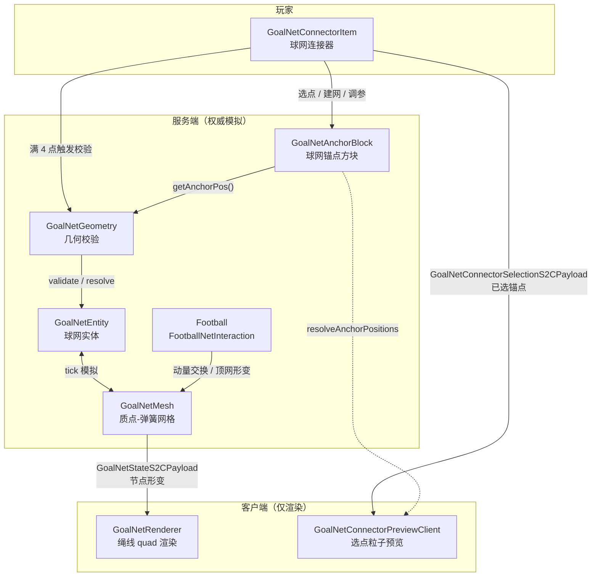

# 球网系统实现文档

本文档描述 **nmbct-football** 模组中「实体化球网」MVP 的当前实现，便于理解架构、修改参数与扩展功能。

> **设计概要**：玩家放置 **球网锚点** 方块，手持 **球网连接器** 依次选中 4 个锚点；服务端校验几何合法性后生成 **球网实体**。球网在服务端以质点-弹簧网格模拟形变，客户端仅接收节点位置并渲染绳线；足球撞击时与网面交换动量并顶出凹陷。

---

## 目录

1. [架构总览](#架构总览)
2. [游戏内用法](#游戏内用法)
3. [核心组件](#核心组件)
4. [几何校验](#几何校验)
5. [物理模拟](#物理模拟)
6. [足球交互](#足球交互)
7. [网络同步](#网络同步)
8. [客户端渲染与预览](#客户端渲染与预览)
9. [音效](#音效)
10. [配置参数速查](#配置参数速查)
11. [源码文件索引](#源码文件索引)
12. [已知限制与后续方向](#已知限制与后续方向)

---

## 架构总览



**权威模型**：物理与碰撞仅在服务端运行；客户端不模拟，只接收 `GoalNetStateS2CPayload` 并绘制。

**与旧方案的关系**：原先基于 `goal_net` 方块的静态模型方案已移除；当前为「锚点方块 + 连接器 + 实体」架构。

---

## 游戏内用法

### 放置锚点

1. 放置 **球网锚点**（`goal_net_anchor`）。
2. 普通放置：根据点击位置自动选择最近的锚点位置（中心 / 面 / 边 / 角，共 27 种 `position` 状态）。
3. **Shift + 放置**：强制放在方块中央（`position=c`）。

锚点的 **逻辑连接点** 不一定在方块几何中心，由 `GoalNetAnchorBlock.getAnchorPos()` 根据 `position` 偏移决定。

### 用连接器建网

手持 **球网连接器**（`goal_net_connector`）：

| 操作 | 条件 | 效果 |
|------|------|------|
| 右键 | 视线首个方块为锚点 | 记录该锚点（1/4 → 4/4） |
| 右键 | 已选满 4 点且几何合法 | 生成球网实体，清空选点 |
| 右键 | 已选满 4 点但几何非法 | 失败提示 + 清空选点 |
| 右键 | 重复点击已选锚点 | 提示重复，不追加 |
| 右键 | 视线命中球网实体 | 提高松弛度（slack +5%） |
| Shift + 右键 | 视线命中球网实体 | 降低松弛度（slack −5%） |
| Shift + 右键 | 视线未命中方块/实体（空气） | 清空已选锚点 |
| 左键 | 命中球网实体 | 销毁球网 |

**射线优先级**（`GoalNetConnectorItem.handleUse`）：

1. 方块射线（距离 = `block_interaction_range`），首个方块为锚点则处理选点。
2. 实体射线（距离 = `entity_interaction_range`），命中球网则调节松弛度。
3. Shift + 右键空气 → 清空选点。

指向球网实体时，`Item.use()` 会 `PASS`，由 `UseEntityCallback` 统一处理，避免 Shift+右键误触发清空。

### 客户端预览

手持连接器且已有选点时：

- **黄色粒子**：已选锚点的真实世界坐标。
- **绿色粒子**：按选择顺序连成的折线。
- 准星指向球网实体时不显示预览（避免与调参操作冲突）。

---

## 核心组件

### 1. 球网锚点方块 — `GoalNetAnchorBlock`

| 项目 | 说明 |
|------|------|
| 注册 ID | `nmbct-football:goal_net_anchor` |
| 源码 | `src/main/kotlin/.../block/GoalNetAnchorBlock.kt` |
| 状态属性 | `position` → `GoalNetAnchorPosition`（27 种） |
| 关键 API | `getAnchorPos(pos, state): Vec3` |

`GoalNetAnchorPosition` 通过方向向量组合计算偏移（±0.5 方块），支持中心、六面、十二边、八角。

碰撞箱与模型按位置类型分别定义（`center` / `face` / `side` / `corner` 四类 block model）。

### 2. 球网连接器 — `GoalNetConnectorItem`

| 项目 | 说明 |
|------|------|
| 注册 ID | `nmbct-football:goal_net_connector` |
| 源码 | `src/main/kotlin/.../item/GoalNetConnectorItem.kt` |
| 选点状态 | `GoalNetConnectorState`（服务端 `HashMap<UUID, List<BlockPos>>`） |

选点变更后通过 `FootballNetworking.sendGoalNetConnectorSelection` 同步到对应玩家客户端。

### 3. 球网实体 — `GoalNetEntity`

| 项目 | 说明 |
|------|------|
| 注册 ID | `nmbct-football:goal_net` |
| 源码 | `src/main/kotlin/.../entity/GoalNetEntity.kt` |
| 类别 | `MobCategory.MISC`，无重力，不可被伤害 |
| 跟踪范围 | 96 格，`updateInterval` 20 |

**生命周期**：

- `setup(level, anchorBlocks, slack)`：解析锚点 → 几何校验 → 创建 `GoalNetMesh` → 设置包围盒。
- `tick()`（仅服务端）：活跃期每 tick 模拟 + 广播；静止后每 20 tick 低频同步。
- 持久化：保存 4 个锚点方块坐标与 `slack`；读档时重新 `setup`。

**活跃判定**：`activeTicks` 在扰动（足球撞击、调节 slack）后设为 60；每 tick 若节点总位移平方和低于阈值则递减，归零后进入静止模式。

### 4. 交互注册 — `GoalNetInteractions`

Fabric 事件：

- `AttackEntityCallback`：左键 + 手持连接器 → 销毁球网。
- `UseEntityCallback`：右键命中球网 → 委托 `GoalNetConnectorItem.handleUse`。

---

## 几何校验

**源码**：`src/main/kotlin/.../util/GoalNetGeometry.kt`

### 流程

1. `resolveAnchorPositions(level, blocks)`：读取每个锚点方块的 `getAnchorPos`。
2. `validate(anchorPositions)`：检查能否构成合法矩形网面。

### 合法条件

四个锚点必须：

1. 互不相同（浮点容差 `1e-4`）。
2. 共面，且平面为 **轴对齐的水平面或竖直面**（某一坐标轴上四值相同）。
3. 在该平面上构成 **非退化长方形**（两轴各恰好 2 个不同坐标值，且四角匹配）。

### 失败原因与提示

| `Failure` 枚举 | 翻译键 |
|----------------|--------|
| `NOT_ENOUGH_POINTS` | `message.nmbct-football.goal_net.fail.not_enough` |
| `DUPLICATE_POINTS` | `message.nmbct-football.goal_net.fail.duplicate` |
| `NOT_COPLANAR` | `message.nmbct-football.goal_net.fail.not_coplanar` |
| `NOT_RECTANGLE` | `message.nmbct-football.goal_net.fail.not_rectangle` |
| `DEGENERATE` | `message.nmbct-football.goal_net.fail.degenerate` |
| `INVALID_ANCHOR` | `message.nmbct-football.goal_net.fail.invalid_anchor` |

### `NetRectangle`

校验成功后返回：

- `origin`：矩形一角的世界坐标。
- `uAxis` / `vAxis`：两条边的单位方向。
- `uLength` / `vLength`：边长。
- `normal`：平面法向（用于碰撞与渲染朝向）。

网格分辨率：`resolveNodeCount(length) = round(length / TARGET_NODE_SPACING) + 1`，限制在 `[MIN_NODES_PER_AXIS, MAX_NODES_PER_AXIS]`。

---

## 物理模拟

**源码**：

- `src/main/kotlin/.../physics/GoalNetMesh.kt` — 网格结构与步进。
- `src/main/kotlin/.../physics/GoalNetConfig.kt` — 全部可调常量。

### 网格结构

- 节点排列在 `NetRectangle` 张成的 `cols × rows` 平面上。
- **边界节点**（四边）钉死在初始框架位置（`pinned = true`）。
- **弹簧**：水平、竖直结构边 + 对角剪切弹簧（增强稳定性）。

### 求解方法

每 tick 一步 **Verlet 积分 + 位置约束（PBD）**：

1. 非固定节点：施加阻尼、重力（Y 方向 `-GRAVITY`）。
2. 多轮约束迭代：弹簧 rest length = `baseLength × (1 + slack)`。
3. 返回节点总位移平方和，用于静止判定。

`slack`（松弛度）越大，弹簧静止长度越长，网在自然重力下下垂越明显。

### 对外 API

| 方法 | 用途 |
|------|------|
| `step(): Double` | 推进一步模拟 |
| `setSlack(value)` | 调节松弛度并重置约束尺度 |
| `applyDisplacement(point, displacement, radius)` | 足球撞击时顶出附近节点 |
| `writeRelative(origin, out)` | 导出相对实体原点的 float 数组供网络同步 |

---

## 足球交互

**源码**：`src/main/kotlin/.../physics/FootballNetInteraction.kt`  
**调用点**：`Football.kt` 每 tick 位移完成后，在方块碰撞解析之后。

### 检测

在球心移动路径周围搜索 `GoalNetEntity`，对每张网：

1. 将球心投影到网面，检查是否在矩形范围内（含球半径余量）。
2. 判定穿面（`distPrev × distNow < 0`）或贴近（距离 < 球半径 + `CONTACT_MARGIN`）。
3. 仅在朝网运动或已穿透时生效。

### 动量交换

- **法向速度**：吸收 `BALL_NORMAL_ABSORPTION`（默认 82%），球不反弹。
- **切向速度**：保留 `BALL_TANGENT_RETENTION`（默认 70%），实现贴网下滑。
- **网面形变**：按穿透深度与入射速度，在 `BALL_PUSH_RADIUS` 内对节点施加位移，并 `markDisturbed()`。
- **球位置修正**：将球心置于网面入射侧、距网面一个球半径处，防止穿透。

> **注意**：碰撞检测基于 **初始矩形平面**，而非实时变形后的网格曲面；高速射门可能穿网，属已知 MVP 限制。

---

## 网络同步

**注册**：`FootballNetworking.kt`

### `GoalNetStateS2CPayload`

| 字段 | 说明 |
|------|------|
| `entityId` | 球网实体 ID |
| `cols` / `rows` | 网格尺寸 |
| `relativePositions` | `float[cols×rows×3]`，相对实体原点的节点偏移 |

- 通道 ID：`nmbct-football:goal_net_state`
- 广播对象：`PlayerLookup.tracking(entity)`
- 客户端接收：`GoalNetStateClient` → `entity.applyClientState(...)`

### `GoalNetConnectorSelectionS2CPayload`

| 字段 | 说明 |
|------|------|
| `anchorBlocks` | 当前已选锚点（最多 4 个 `BlockPos`） |

- 通道 ID：`nmbct-football:goal_net_connector_selection`
- 仅发送给操作玩家本人
- 客户端接收：`GoalNetConnectorPreviewClient`

---

## 客户端渲染与预览

### 球网渲染 — `GoalNetRenderer`

- 注册于 `NMBCTFootballClient`。
- 将网格的水平/竖直结构边画成 **朝向相机的细长四边形**（`submitCustomGeometry` + `RenderTypes.debugQuads()`）。
- 线宽：`LINE_HALF_WIDTH + 到相机距离 × LINE_WIDTH_DISTANCE_GAIN` → **世界空间固定宽度**，远近距离感变化（非屏幕像素恒定）。
- 颜色：`GoalNetConfig.LINE_COLOR_ARGB`（默认 `0xFFEDEDED`）。

当前 **不做** 节点位置插值；同步包到达后直接更新 `clientRelative`。

### 选点预览 — `GoalNetConnectorPreviewClient`

- 每客户端 tick 末，若主手/副手持有连接器且有选点，spawn `DustParticleOptions` 粒子。
- 复用 `GoalNetGeometry.resolveAnchorPositions` 解析锚点坐标（客户端也可读方块状态）。

---

## 音效

**源码**：`src/main/kotlin/.../item/GoalNetConnectorSounds.kt`

所有连接器相关音效集中在此 object，顶部 KDoc 含完整修改指南。

| 场景 | 默认原版音效 | 自定义 SoundEvent ID |
|------|--------------|------------------------|
| 选中锚点 | 音符盒 Pling | `item.goal_net_connector.select` |
| 重复选点 | 音符盒 Bass | `item.goal_net_connector.duplicate` |
| 建网成功 | 经验球拾取 | `item.goal_net_connector.create` |
| 建网失败 | 村民拒绝 | `item.goal_net_connector.fail` |
| 清空选点 | 书页翻动 | `item.goal_net_connector.clear` |
| 松弛度 + | 拉杆点击（高音） | `item.goal_net_connector.slack_up` |
| 松弛度 − | 拉杆点击（低音） | `item.goal_net_connector.slack_down` |
| 销毁球网 | 剪刀修剪 | `item.goal_net_connector.destroy` |

替换为自定义 `.ogg`：

1. 放入 `assets/nmbct-football/sounds/goal_net_connector/`（如 `select.ogg`）。
2. `sounds.json` 中已有对应条目模板。
3. 将 `SoundSpec.event` 改为 `register("item.goal_net_connector.xxx")` 并在 `init()` 中触发注册。

---

## 配置参数速查

修改 `GoalNetConfig.kt`（独立于足球 `PhysicsSettings`，不影响其编解码）：

### 网格

| 常量 | 默认值 | 含义 |
|------|--------|------|
| `TARGET_NODE_SPACING` | `0.5` | 目标节点间距（方块） |
| `MIN_NODES_PER_AXIS` | `3` | 单轴最少节点数 |
| `MAX_NODES_PER_AXIS` | `12` | 单轴最多节点数 |

### 模拟

| 常量 | 默认值 | 含义 |
|------|--------|------|
| `GRAVITY` | `0.018` | 每 tick 重力（Verlet 位移量） |
| `DAMPING` | `0.97` | 速度阻尼 |
| `CONSTRAINT_ITERATIONS` | `6` | 弹簧约束迭代次数 |
| `DEFAULT_SLACK` | `0.08` | 初始松弛度 |
| `MIN_SLACK` / `MAX_SLACK` | `0.0` / `0.45` | 松弛度范围 |
| `SLACK_STEP` | `0.05` | 每次调节步长 |
| `ACTIVE_TICKS_AFTER_DISTURB` | `60` | 扰动后活跃模拟 tick 数 |
| `SETTLE_SPEED_SQR` | `1e-7` | 静止判定阈值 |

### 足球交互

| 常量 | 默认值 | 含义 |
|------|--------|------|
| `BALL_NORMAL_ABSORPTION` | `0.82` | 法向动量吸收比例 |
| `BALL_TANGENT_RETENTION` | `0.7` | 切向速度保留比例 |
| `BALL_PUSH_RADIUS` | `1.25` | 顶网影响半径 |
| `BALL_PUSH_STRENGTH` | `0.9` | 顶网位移系数 |
| `CONTACT_MARGIN` | `0.12` | 接触判定余量 |

### 渲染

| 常量 | 默认值 | 含义 |
|------|--------|------|
| `LINE_HALF_WIDTH` | `0.013` | 绳线半宽（方块） |
| `LINE_WIDTH_DISTANCE_GAIN` | `0.0016` | 远距离线宽增益 |
| `LINE_COLOR_ARGB` | `0xFFEDEDED` | 绳线颜色 |

---

## 源码文件索引

### 服务端 / 共通

| 文件 | 职责 |
|------|------|
| `block/GoalNetAnchorBlock.kt` | 锚点方块、位置枚举、碰撞箱 |
| `block/Blocks.kt` | 注册 `GOAL_NET_ANCHOR` |
| `item/GoalNetConnectorItem.kt` | 连接器交互主逻辑 |
| `item/GoalNetConnectorState.kt` | 服务端选点状态 |
| `item/GoalNetConnectorSounds.kt` | 音效定义与播放 |
| `item/Items.kt` | 注册 `GOAL_NET_CONNECTOR` |
| `entity/GoalNetEntity.kt` | 球网实体、tick、持久化 |
| `util/GoalNetGeometry.kt` | 锚点解析与矩形校验 |
| `physics/GoalNetMesh.kt` | 质点-弹簧模拟 |
| `physics/GoalNetConfig.kt` | 物理与渲染常量 |
| `physics/FootballNetInteraction.kt` | 足球-球网碰撞 |
| `GoalNetInteractions.kt` | Fabric 实体交互事件 |
| `network/GoalNetStateS2CPayload.kt` | 形变同步包 |
| `network/GoalNetConnectorSelectionS2CPayload.kt` | 选点同步包 |
| `network/FootballNetworking.kt` | 包注册与发送 |
| `NMBCTFootball.kt` | 实体/音效/init、交互注册 |
| `Football.kt` | 足球 tick 中调用网交互 |

### 客户端

| 文件 | 职责 |
|------|------|
| `client/render/GoalNetRenderer.kt` | 绳线 quad 渲染 |
| `client/render/GoalNetRenderState.kt` | 渲染状态 |
| `client/render/GoalNetStateClient.kt` | 接收形变 S2C |
| `client/render/GoalNetConnectorPreviewClient.kt` | 选点粒子预览 |
| `client/NMBCTFootballClient.kt` | 渲染器与客户端 handler 注册 |

### 资源

| 路径 | 说明 |
|------|------|
| `assets/.../blockstates/goal_net_anchor.json` | 27 种 position → 模型映射 |
| `assets/.../models/block/goal_net_anchor/` | center / face / side / corner |
| `assets/.../textures/block/goal_net_anchor.png` | 锚点纹理 |
| `assets/.../items/goal_net_anchor.json` | 物品定义 |
| `assets/.../items/goal_net_connector.json` | 连接器物品定义 |
| `assets/.../textures/item/goal_net_connector.png` | 连接器纹理 |
| `assets/.../sounds.json` | 连接器自定义音效条目（模板） |
| `assets/.../lang/zh_cn.json`、`en_us.json` | 本地化 |
| `data/.../loot_table/blocks/goal_net_anchor.json` | 锚点战利品表 |

---

## 已知限制与后续方向

### 当前 MVP 限制

1. **碰撞平面简化**：足球与网的交互基于初始 `NetRectangle` 平面，未跟踪实时网格形变；变形较大或球速极高时可能穿网。
2. **无客户端插值**：节点位置在收到 S2C 包时跳变，快速形变可能略抖。
3. **渲染类型**：使用 `RenderTypes.debugQuads()`，非专用半透明绳网材质；深度排序与光照未专门优化。
4. **锚点模型**：blockstate 已支持 27 种 position，但部分 block model 仍较占位；可按 `position` 进一步细化外观。
5. **选点顺序**：建网时按点击顺序连预览线，几何校验不要求特定顺序，但四角必须能匹配长方形顶点集。
6. **旧 `goal_net` 方块**：资源目录中可能仍残留旧条目（如 `items/goal_net.json`），与当前实现无关，可择机清理。

### 可考虑的增强

- 基于变形后网格或 AABB 树的精确碰撞。
- 客户端节点插值与自定义 `RenderType`（带纹理的绳线）。
- 多球网并存时的性能 profiling（节点上限、同步频率策略）。
- 与比赛系统（球门判定）的深度集成。
- 锚点破坏时自动销毁关联网实体。

---

## 初始化入口

**服务端**（`NMBCTFootball.kt`）：

```kotlin
GoalNetEntity.init()
GoalNetConnectorSounds.init()
GoalNetInteractions.register()
```

**客户端**（`NMBCTFootballClient.kt`）：

```kotlin
EntityRenderers.register(GoalNetEntity.ENTITY_TYPE, ::GoalNetRenderer)
GoalNetStateClient.register()
GoalNetConnectorPreviewClient.register()
```

---

*文档版本与代码同步至当前工作区实现。修改球网行为后请同步更新本文档。*
